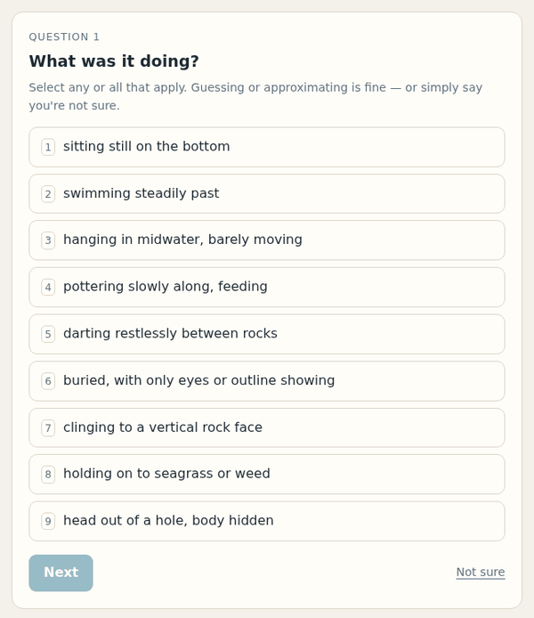

# ribice

An expert system that identifies something by asking the fewest questions it can.
It ships with a knowledge base of 61 fish you might meet snorkelling the shallows
of the Croatian Adriatic, but the engine knows nothing about fish -- point it at
any JSON file describing any set of things.

A live demo runs at **[codecrane.hr/ribice](https://codecrane.hr/ribice/)** --
the browser build below, mounted in a page.

<p align="center">
  
</p>

That is the browser build: one static page, no backend, [embeddable in another
application](#embedding-it). The photograph in it is Dmitriy Konstantinov's, CC BY-SA 3.0 -- see
[Pictures](#pictures) for why every result carries its credit. The same engine
runs on the command line:

```
$ go run ./cmd/ribice

Fish of the Croatian Adriatic shallows -- 61 candidates, 17 properties.
Answer with a number, or several (1,3). Other keys: (s)kip, (u)ndo, (w)hy, (g)ive up, (q)uit.

Q1. What was it doing?
   1) sitting still on the bottom
   2) swimming steadily past
   3) hanging in midwater, barely moving
   4) pottering slowly along, feeding
   ...
> 1
   -> Black scorpionfish 7% · Painted comber 7% · Striped red mullet 7%
```

## How it picks questions

The session holds a probability distribution over every candidate, starting at
the knowledge base's priors. Each question is scored by **expected information
gain**: how many bits of entropy the answer is expected to remove.

```
IG(a) = H(P) - Σ_v P(answer = v) · H(P | answer = v)
```

The highest-scoring question is asked, the answer updates the distribution by
Bayes' rule, and the loop repeats until one candidate passes the confidence
threshold. Choosing greedily like this is the standard approximation to the
optimal decision tree problem, which is NP-hard; greedy is within a `O(log n)`
factor of optimal and is what actually gets used in practice.

Two things follow from working on a distribution rather than a shrinking set of
survivors:

- **A wrong answer is not fatal.** Each attribute carries a `noise` value, the
  probability the user misremembers it. A contradicted candidate loses most of
  its probability but is never eliminated, so later answers can bring it back.
  With a fifth of all answers wrong, the fish KB still identifies four species
  in five -- it just takes a few more questions.
- **Mistakes are not uniform** -- see the next section.
- **"Not sure" is free.** Skipping applies no update at all, and the question
  comes back later if it turns out to decide things. Skipping means "I cannot
  say right now", not "never ask me this".
- **The answer may be nothing at all** -- see below.

Because a property an entity does not declare is taken to be _absent_, every
categorical attribute must be one where "none" is a real answer -- no pattern,
an ordinary snout, no head marking. "Tail shape" would not qualify, since every
fish has one, so that is the boolean `forked_tail` instead.

## When it is none of them

A belief distribution over 61 species always sums to one, so without help the
engine cannot report anything but one of its 61. Describe a fish it has never
heard of and it will name the closest one it has, at whatever confidence falls
out. For a field guide that is the worst failure there is.

So the distribution carries one extra candidate: the species the knowledge base
does not have. `UnknownPrior` is how likely that is before any question -- 0.15
by default, meaning roughly one sighting in seven is something not covered here.

What it predicts matters more than its prior. It is not a thing with no
properties; it is a species from the same fauna that happens to be missing, so
it predicts each answer at the rate that answer occurs across the knowledge
base, half-mixed with a flat distribution. That makes it a detector for
*unattested combinations*: every answer stays individually plausible under it,
so it loses almost no ground while a real candidate matches, and pulls ahead as
soon as the answers stop fitting any one species.

Both halves of that are load-bearing. A purely flat distribution pays a heavy
penalty on every high-cardinality match and can never catch up. A pure
population rate makes rare values -- `big_eyes` is held by three species -- less
likely under "unknown" than under a known species that simply has it wrong, so a
contradiction would become evidence *for* the known species.

It is not free. Measured against species that are in the knowledge base, so the
benefit is invisible and only the cost shows:

| answers wrong | unknown off | unknown at 0.15 |
| --- | --- | --- |
| 15% | 90% right, 10% named wrongly | 93% right, 6% named wrongly, 1% unsure |
| 25% | 80% right, 20% named wrongly | 75% right, 20% named wrongly, 5% unsure |
| 35% | 69% right, 31% named wrongly | 61% right, 27% named wrongly, 11% unsure |

At realistic error rates it costs nothing. Once a third of answers are wrong it
turns more right answers into "unsure" than it saves from being wrong, which is
the honest shape of the trade. `-unknown 0` switches it off.

Its real limit is that it can only notice what the attributes can express. A
missing species that is describable as a known one plus two cheap mistakes will
be named as that known one, and no prior will fix it -- only a new attribute
that tells them apart.

## Answers that look alike

People do not misremember at random. Told to judge a shape, they mix up
"torpedo" and "elongated" constantly and never once say "seahorse". Treating
every mistake as equally likely punishes the near miss exactly as hard as the
absurd one, which is what made early testers feel the questions were unfair.

An attribute can declare which of its values look alike:

```json
"shape": {
  "noise": 0.06,
  "confusion": 0.3,
  "confusable": [["torpedo", "elongated"], ["flat", "disc"], ["tiny", "small"]]
}
```

The error budget then splits in two. `confusion` is the chance the user names a
declared look-alike; `noise` is the chance they name something unrelated, spread
evenly over the rest. So answering "torpedo" leaves an elongated fish nearly
intact while still ruling out a seahorse. Grouping is symmetric but does not
chain: listing `a-b` and `b-c` makes `b` a look-alike of both without making `a`
and `c` look alike, which is what you want for ordinal runs like tiny-small-medium-large.

This costs something, and it should. Admitting that two answers are hard to tell
apart genuinely reduces how much that question can tell you, so the engine
scores it lower and asks more questions. Measured on the fish KB, against the
same simulated mistakes, modelling the structure rather than assuming uniform
error:

| answers wrong | uniform error model | look-alikes declared |
| --- | --- | --- |
| 0% | 100% in 4.9 questions | 100% in 5.3 |
| 15% | 50% in 6.4 | **91%** in 6.7 |
| 25% | 34% in 7.0 | **80%** in 7.4 |
| 35% | 16% in 7.4 | **69%** in 7.8 |

Roughly half a question more, for two to four times the accuracy once the user
starts making the mistakes real users make.

An attribute that declares no groups keeps the old uniform behaviour exactly.

## Picking more than one answer

Any question takes several answers -- `1,3` rather than `1`. What that means
depends on the attribute, because two different things get said that way.

For an ordinary attribute the entity has exactly one value, so several picks
mean **"one of these, I could not tell which"**. The probabilities add. It is
weaker evidence than a single answer and does not discriminate between the
options you named, but it still rules out everything you did not name -- much
better than skipping.

An attribute an entity can genuinely hold several of at once is marked
`"multi": true`. There, each pick is **a separate observation**, so the
probabilities multiply and entities holding all of them are favoured over
entities holding just one:

```
over rocks                -> Damselfish 6% · Rainbow wrasse 6% · Two-banded seabream 6%
in seagrass               -> Salema 13% · Annular seabream 10% · Peacock wrasse 10%
over rocks + in seagrass  -> Salema 18% · Annular seabream 14% · Peacock wrasse 14%
```

"Over rocks" barely narrows anything -- twenty species live there. Naming both
habitats picks out the species that occupy both, without eliminating the
rocks-only fish: they drop back rather than dying.

Ranking still scores a question as though one answer were coming, so for a
`multi` attribute the reported gain is a lower bound -- fine for ordering
questions, and it never oversells one.

Questions are ranked by `gain / cost`, so an attribute the user can barely judge
("how many dorsal fin rays?") can be given a high `cost` and will only be asked
when it genuinely pays.

## Knowledge base format

The simplest form is a bare array of entities. Every property is optional and
arbitrary; a property an entity does not mention is assumed **not present**.

```json
[
  { "name": "catfish", "colour": "gray", "moustache": true },
  { "name": "trout", "colour": "gray", "pattern": "checkered" }
]
```

- **Booleans** become yes/no questions. An attribute is boolean when every
  entity that mentions it gives a boolean.
- **Strings** become multiple-choice questions over the values actually used.
- **An array of values** means "any of these": `"colour": ["grey", "silver"]`.
- **`"none"`, `null` and omitting the property** are the same thing.

To add phrasing, priors and noise, wrap the list in an object. All of it is
optional -- a bare array works fine.

```json
{
  "name": "Adriatic snorkelling fish",
  "attributes": {
    "colour": {
      "question": "What colour did it mostly look?",
      "noise": 0.25,
      "cost": 1.0,
      "multi": false,
      "labels": { "multicoloured": "several bright colours at once" }
    }
  },
  "entities": [
    {
      "name": "Salema",
      "_prior": 5,
      "_note": "Sarpa salpa - golden stripes on silver, always in schools.",
      "colour": ["silver", "gold"],
      "schooling": true
    }
  ]
}
```

| Field      | Meaning                                                                                                                                     |
| ---------- | ------------------------------------------------------------------------------------------------------------------------------------------- |
| `question` | How to phrase it. Auto-generated from the attribute name otherwise.                                                                         |
| `labels`   | Display text per value, for when the raw value is too terse.                                                                                |
| `noise`    | P(the user gets this wrong). Defaults to 0.12. Raise it for colour and size, lower it for unmistakable features.                            |
| `cost`     | Relative effort of asking. Questions are ranked by gain ÷ cost.                                                                             |
| `multi`    | The entity can hold several of these at once, so picking several answers means "all of these", not "one of these". Meaningless on booleans. |
| `_prior`   | Relative frequency of this entity. Defaults to 1 for everything.                                                                            |
| `_note`    | Free text shown with the result.                                                                                                            |

Keys starting with `_` are metadata, never questions. `name` identifies the
entity and is required.

### Pictures

An entity may carry one canonical picture, for a front end to show alongside the
result:

```json
"_image": {
  "url": "https://upload.wikimedia.org/wikipedia/commons/d/d8/Diplodus_annularis_Minorca.jpg",
  "source": "https://commons.wikimedia.org/wiki/File:Diplodus_annularis_Minorca.jpg",
  "credit": "Roberto Pillon",
  "license": "CC BY 3.0"
}
```

All four fields matter. Almost every licence worth using requires naming the
author and the licence, so a bare `url` is a liability rather than a
convenience: `-lint` warns about a picture with no `credit` or no `license`, and
notes one with no `source` page, since without it the terms cannot be checked.
**Anything displaying these images must show the credit and licence.**

The 60 pictures in `data/adriatic-fish.json` come from Wikimedia Commons, via
the lead image of each species' Wikipedia article. Licences are CC BY, CC BY-SA
or public domain, every one with a named author. The European barracuda has
none: the only Commons photographs found were of other *Sphyraena* species, and
the wrong fish is worse than no fish in an identification guide.

## Commands

```
go run ./cmd/ribice                      # play, against data/adriatic-fish.json
go run ./cmd/ribice -kb data/other.json  # play against another knowledge base
go run ./cmd/ribice -explain             # show bits gained per question while playing
go run ./cmd/ribice -lint                # check a knowledge base for problems
go run ./cmd/ribice -stats               # attributes, domains, uncertainty
go run ./cmd/ribice -simulate            # self-test: play one game per entity
go run ./cmd/ribice -simulate -sim-noise 0.25
```

`-lint` catches the mistakes that quietly ruin a knowledge base: one property
spelled two ways (`color` and `colour` become two unrelated questions),
attributes that can never discriminate, entities no question can tell apart, and
`multi` on a boolean, where it does nothing.

`-simulate` plays the whole quiz once per entity, answering truthfully, and
reports what fraction were identified and how many questions it took. With
`-sim-noise` it gets answers wrong at that rate, preferring a declared
look-alike over a random value, since that is how people actually err. Run it
after every edit to the knowledge base:

```
$ go run ./cmd/ribice -simulate
self-test: 61 entities, answer error rate 0%

identified      61/61 (100%)
questions       5.6 average, 10 worst
uncertainty     5.77 bits to resolve (5.93 if priors were flat)

Every entity was identified.
```

With 15% of answers wrong it still lands 95%. With a quarter wrong it lands
70%, and the misses are mostly a declared look-alike rather than nonsense --
one seabream for another, the stargazer for the scorpionfish.

## In the browser

The same engine compiles to WebAssembly and runs as a static page -- no backend,
no API, nothing to keep running. `cmd/wasm` is the browser's equivalent of
`cmd/ribice`: it exposes the session to JavaScript and lets the page worry about
pixels.

```
./build.sh                  # builds web/
./build.sh serve            # and serves it on http://localhost:8080
./build.sh publish [DIR]    # copies the embeddable assets to DIR (default dist/)
```

`web/` is then six static files. Three are written by hand, three are generated
and not in version control:

```
index.html            a demo page -- not needed to embed
ribice.js             the widget, an ES module
ribice.css            its default theme, entirely optional
ribice.wasm           3.2 MB, 0.9 MB over the wire gzipped     (generated)
wasm_exec.js          Go's runtime shim                        (generated)
adriatic-fish.json    the knowledge base, fetched at page load (generated)
```

Two things the host must get right: `.wasm` served as `application/wasm` (the
page falls back to a buffered compile if not, just more slowly), and no
rewriting of `wasm_exec.js`, which is version-locked to the toolchain --
`./build.sh` re-copies it from your `GOROOT` every time so the two cannot drift.

The knowledge base is fetched rather than embedded, so correcting a fish means
re-uploading the JSON, not rebuilding the WebAssembly.

### Embedding it

`./build.sh publish` writes the five files an application needs into `dist/`,
without the demo page, alongside a README covering what the embedder has to know
-- serving, styling, options and the attribution the image licences require.
Pass a directory to publish straight into another project:

```
./build.sh publish ~/mysite/public/vendor/ribice
```

It lints the knowledge base first, since that ships as an asset too, and prints
what each file costs over the wire.

`dist/` is committed rather than ignored, so the site can be deployed and the
widget embedded without a Go toolchain anywhere in the loop. The WebAssembly is
built with `-trimpath -buildvcs=false`, which keeps both the developer's home
directory and the repository's commit hash and dirty flag out of a published
asset. That second flag is load-bearing here: `dist/` being tracked means
publishing dirties the repo, a stamped binary would change on the next build
because of it, and the two would chase each other forever. Without the stamp the
build is byte-identical, so re-publishing unchanged produces no diff and `dist/`
only moves when the engine or the knowledge base does. Re-run `./build.sh
publish` and commit it whenever either changes.

Upload the assets somewhere and mount the widget on any element:

```html
<div id="fish"></div>
<script type="module">
  import { createQuiz } from "/assets/ribice/ribice.js";
  const quiz = await createQuiz({ mount: "#fish", base: "/assets/ribice/" });
</script>
```

`base` is where the other three files live; `wasmUrl`, `execUrl` and `kbUrl`
override individually if they are scattered. Everything else is optional:

| Option | Meaning |
| --- | --- |
| `settings` | engine `Config` overrides: `threshold`, `maxQuestions`, `unknownPrior`, ... |
| `keyboard` | number keys select, Enter confirms, `s` skips, `u` goes back. Default on. |
| `standing` | show the running leaders and the answers so far. Default on. |
| `top` | how many candidates the result lists. Default 5. |
| `strings` | any rendered string, to retitle or translate. |
| `onQuestion`, `onResult`, `onError` | callbacks, for analytics or for reacting in the host app. |

It returns `{root, view, restart(), destroy()}`. Call `destroy()` when tearing
down a route in a single-page app: it releases the session and unbinds the key
handler.

Several quizzes may be mounted on one page, over the same knowledge base or
different ones. The WebAssembly module and each knowledge base are fetched once
and shared; sessions are independent.

### Styling it

The widget writes no styles. It renders semantic markup, gives every element an
`rb-` class, and puts state in attributes the host can select on --
`[aria-pressed="true"]` for a chosen option, `[data-rb-state]` on the root for
`loading`/`question`/`result`/`error`. With no stylesheet at all it is plain but
fully usable, and inherits the host's own typography and button styling.

`ribice.css` is one theme, not a requirement. It is scoped entirely under
`.rb-quiz` and selects no bare elements, so it changes nothing outside the
widget. To restyle without editing it, set its custom properties on the mount
element:

```css
#fish {
  --rb-accent: #7b2d8e;
  --rb-card: #fff;
  --rb-radius: 3px;
  --rb-font: Georgia, serif;
}
```

`--rb-bg`, `--rb-card`, `--rb-ink`, `--rb-muted`, `--rb-line`, `--rb-accent`,
`--rb-accent-soft`, `--rb-accent-ink`, `--rb-warn`, `--rb-radius`,
`--rb-radius-sm`, `--rb-gap`, `--rb-pad`, `--rb-font` and `--rb-size`. Dark mode
follows `prefers-color-scheme`; `data-rb-theme="light"` or `"dark"` on the mount
element pins it.

### The JavaScript API underneath

`ribice.js` wraps a lower-level API that the WebAssembly module installs as the
global `ribice`. Use it directly to build a different front end entirely.

Go owns all the state. Every call returns the whole view -- the question to ask,
the standing candidates, what has been answered -- so the page re-renders from
what it gets back and keeps nothing of its own but the session id.

```js
ribice.load(jsonText)            // -> {kb, name, entities, attributes} | {error}
ribice.start({kb, maxQuestions}) // -> view, with .id
ribice.answer(id, [0, 2])        // options chosen; [] means "not sure"
ribice.skip(id)                  // same as answering with nothing
ribice.undo(id)                  // take back the last answer
ribice.state(id)                 // the current view, unchanged
ribice.rank(id)                  // what it is considering: [{attr, text, gain}]
ribice.release(id)               // drop a finished session
```

Every `Config` field can be overridden in the object passed to `start`
(`threshold`, `minGain`, `minSupport`, `unknownPrior`, `maxOptions`,
`maxQuestions`, `skipCooldown`, `confirm`); anything left out keeps
`DefaultConfig`'s value.
`kb` selects which loaded knowledge base to play, defaulting to the last one
loaded. A view looks like this:

```js
{
  id: 1, done: false, reason: "", asked: 3, entropy: 2.14, canUndo: true,
  question: { attr: "shape", text: "What was its overall shape?",
              multi: false, boolean: false, reoffered: false, gain: 0.92,
              options: [{label: "...", other: false, prob: 0.27}, ...] },
  top: [{name, prob, note, link, unknown, image: {url, source, credit, license}}],
  history: [{attr, text, label, skipped}]
}
```

`done` is the engine's own stopping rule, and `reason` is why it stopped in
words fit to show the user ("confident enough", "nothing in this guide
matches"). Picking several options works exactly as it does in the CLI -- pass
several indices.

Every question is select-then-confirm, and several options may be chosen on any
of them. What that means still depends on the attribute (see *Picking more than
one answer*), which is why the instruction is the neutral "select any or all
that apply".

The result screen shows each image with its credit and licence, as those
licences require.

## Layout

```
kb/         loading, normalising and linting a knowledge base
engine/     belief state, Bayesian update, question selection, self-test
cmd/ribice/ the CLI
cmd/wasm/   the same engine, exposed to JavaScript
web/        the embeddable widget, its theme, a demo page, and build output
dist/       the published assets, committed so embedding needs no Go toolchain
data/       knowledge bases
docs/       images for this README
```

`data/adriatic-fish.json` covers the Sparidae you cannot avoid, the wrasses,
blennies, gobies and triplefins of the rocks, the sand-dwellers and the things
buried in it, plus what turns up out in the blue. Each entry carries its Latin
and (where it has one) Croatian name. It is hand-built and worth correcting:
run `-simulate` after any edit to check the species still separate.

`kb` and `engine` have no dependency on the CLI, on any domain, or on an
operating system -- which is what lets the CLI and the browser build sit on the
same two packages unchanged. Standard library only.
