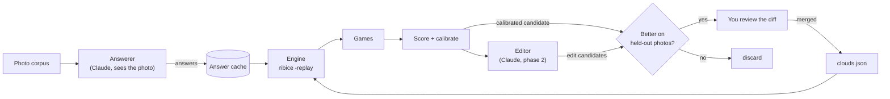

# Calibration loop

Status: phases 0 (`-replay`) and 1a (corpus, 235 photos) done; the rest is design. Clouds first; fish and dogs after, on the same harness.

We will measure how a layperson actually answers the cloud quiz, using Claude
as a stand-in, then tune the knowledge base against those measurements instead
of against guesses.

- [Problem and goals](#problem-and-goals)
- [Overview](#overview)
- [Data](#data)
- [The answerer](#the-answerer)
- [Engine changes](#engine-changes)
- [The harness](#the-harness)
- [Measurement and calibration](#measurement-and-calibration)
- [The editor (phase 2)](#the-editor-phase-2)
- [Risks and open questions](#risks-and-open-questions)
- [Phases](#phases)

## Problem and goals

Today the cloud quiz (32 clouds, 15 questions) averages **8.2 questions per
game, 13 at worst**. That is with a simulated user who never makes a mistake
and answers straight from the JSON. Every `noise`, `confusion` and `cost` value
in `clouds.json` was guessed when the knowledge base was written. Nothing
checks whether a person under the sky can judge "were the lumps shaded grey
underneath?".

`-simulate` shows that the knowledge base agrees with itself. It cannot show
whether the questions work for the people answering them. This loop is for
that.

**Goals**

- Measure, for each question, how often a layperson answers it wrongly or
  can't answer it, and which answers get mixed up.
- Replace the guessed `noise` / `confusable` / `cost` values with measured ones.
- Give an editor (Claude, later) evidence for rewording, dropping or adding
  questions, and accept a change only if the measured score improves.
- Targets for the cloud quiz, measured with the layperson answerer on held-back
  photos: at least 80% right, 6 or fewer questions on average.

**Non-goals**

- No language model at quiz time. The quiz stays static and deterministic;
  Claude is used only offline, to tune the JSON.
- No change to how the engine picks questions (expected information gain ÷
  cost). Only the knowledge base and a new replay mode change.

## Overview

The loop plays quizzes with a Claude answerer that sees only a photo, records
every question and answer, and turns the transcripts into measurements the
knowledge base is tuned against.



1. **Photo corpus.** Labelled cloud photos, split into a tuning set and a
   held-out set.
2. **Answerer.** Claude with vision, told to act as a layperson. It answers
   each question for each photo, or says it can't tell.
3. **Answer cache.** Every answer is stored once, keyed by photo and question
   wording.
4. **Engine.** Unchanged ribice, playing one game per photo from the cached
   answers through a new `-replay` mode.
5. **Score + calibrate.** Plain Python, no model: accuracy, questions per
   game, skip rates and per-question mix-up tables. Measured `noise` and
   `confusable` values are written into a candidate `clouds.json`.
6. **Editor (phase 2).** Claude reads the report and proposes wording and
   structure changes as patches.
7. **Acceptance.** Every candidate, calibrated or edited, is replayed on the
   held-out photos. It is merged only if it scores better, and only after a
   person reviews the diff.

Phase 1 is steps 1–5 and changes no knowledge base on its own. Phase 2 adds
the editor.

## Data

Photos come from Wikimedia Commons' per-species cloud categories, 8 per cloud
where they exist: 5 for tuning, 3 held out. That is about 240 photos.

**Source.** Commons keeps a category per WMO species, named
`Category:<Genus> <species> clouds`. A file there was filed by someone who
judged it to be that cloud, which is a better label than a filename search.
`tools/cloud_images.py` already queries Commons for the one display photo per
cloud. The new `tools/calib/corpus.py` reuses its API helpers and the filename
scoring in `tools/cloud_pick.py`, but keeps many photos per cloud instead of one.

**Coverage.** Counted on 2026-09-26 (files directly in each category):

| Coverage | Clouds |
| --- | --- |
| Plenty (over 100 files) | Cirrus fibratus, Cirrus uncinus, Cirrostratus fibratus, Altocumulus stratiformis, Altocumulus lenticularis, Altocumulus floccus, Stratocumulus stratiformis, Stratocumulus castellanus, Stratocumulus floccus, Nimbostratus, Cumulus humilis, Cumulus mediocris, Cumulus congestus |
| Enough (12–100) | Cirrus spissatus, Cirrus castellanus, Cirrus floccus, Cirrocumulus stratiformis, Cirrocumulus lenticularis, Cirrocumulus floccus, Cirrostratus nebulosus, Altocumulus castellanus, Altostratus translucidus, Stratocumulus lenticularis, Stratus nebulosus |
| Scarce (under 5) | Cirrocumulus castellanus (4), Stratocumulus volutus (3), Stratus fractus (1) |
| Category not found yet | Altocumulus volutus, Altostratus opacus, Cumulus fractus, Cumulonimbus calvus, Cumulonimbus capillatus |

The last row mostly uses other category names: `Category:Cumulonimbus
calvus` (without "clouds") exists with 457 files. The corpus script tries both
spellings, then the parent genus category with a filename filter. A cloud still
under 4 photos is flagged in the report and left out of accuracy totals.

**What the corpus script found** (2026-09-26). Cumulus fractus, both
Cumulonimbus and Stratus fractus have plenty under the name without "clouds".
The other five are scarce for real: roll clouds (both volutus) and castellanus
turrets on a high layer are rare and brief, their photos mostly show two cloud
types and so fail the rules below, and opacus is a variety that people file
under plain Altostratus. For a cloud still short after its categories, the
script falls back to a full-text search of Commons, ranked after every
category photo and marked as such. That search is low-yield: of its 11 picks
the label check passed 2. The first build has 235 photos: 27 clouds with 8,
Altostratus opacus 8 (4 by file name, 4 by search), Cirrus castellanus 4, both
volutus 3 and Cirrocumulus castellanus 1. That is 28 clouds at 5 or more,
before the review drops any; since a dropped photo is refilled, only the
scarce clouds can fall below the gate of 27. Filling them means photos from
outside Commons, such as your own.

**The label check** (2026-09-26, `claude-opus-5` at effort `low`, through the
CLI) doubted 94 of 235 photos: some plainly wrong (a contrail filed as
altocumulus castellanus, shots from a plane, fog among trees, a blown-out white
sky), most arguing a species boundary (mediocris or congestus, fibratus or
uncinus, cirrocumulus or altocumulus lenticularis). The second kind is itself
a finding: if the people who file Commons photos disagree with Claude at those
boundaries, a layperson will too, and the quiz's mix-up tables should show it.

The doubts were kept without review, to get to measurements sooner; each is
marked "kept unreviewed" in `review.json`. To tell whether that matters, the
phase 1b report gives accuracy twice: on all photos, and on those the label
check passed. A large gap means the doubted photos are worth reviewing after
all.

**Selection rules**

- Photos only: skip diagrams, satellite images, paintings and stamps, by
  filename and by MIME type.
- Skip files whose names mention a second genus or species. `cloud_pick.py`
  already penalises these, since they show a whole sky rather than one cloud.
- Skip files filed in two clouds' categories. Whoever filed them saw both, and
  the score would punish the quiz for picking either. About 300 files are.
- Skip the photo the quiz already shows for that cloud, so the answerer is
  never tested on the reference picture.
- Prefer different photographers, so 8 shots of one afternoon don't count as 8
  samples.
- Downscale to 1568 px on the long edge. That is the largest size Claude reads
  without downscaling it again, and it keeps each image to about 2,200 tokens.

**Label check.** Commons labels are sometimes wrong. A one-time vision pass
asks Claude whether each photo shows mainly one cloud type and whether it
matches the label; photos it doubts go to a short list for a person to accept
or drop, in `corpus/<kb>/review.json`. This pass sees the label, so it never
feeds scores, only cleaning. It also flags photos taken from above the clouds,
since every question is asked from the ground.

**Split.** A fixed split by hash of the file name puts 5 photos in tune and 3
in held-out per cloud (fewer held out for a cloud with under 6), and it never
changes between runs: the manifest pins every photo's split, and a later run
only adds photos to fill a cloud that is short. Phase 2 edits may only look at
tune transcripts.

**Storage.** `tools/calib/corpus/<kb>/manifest.json` (committed) lists file name,
label, split, credit and licence. The image bytes go in a gitignored cache and
are fetched again from the manifest. Photos are used locally and never
published, but the credits are kept in case a photo is ever promoted into the
quiz.

**Your own photos.** A folder of your own sky photos, labelled or not, is the
most valuable addition. It is what real use looks like, phone photos included,
and it is the final test set the loop never tunes on.

## The answerer

The answerer sees one photo and one question at a time. It answers every
question for every photo once, and the answers are cached. Games are then
replayed from that cache for free, and any knowledge-base variant that keeps
the question wording is scored without a new API call.

**Why one question at a time, not a live game.**

- **Honest.** Seeing the whole sequence lets a model guess the target from the
  drift of the questions ("it keeps asking about lumps"). Alone, each question
  gets judged on the photo.
- **Cheap.** The 15 questions of one photo share a cached prefix (system prompt
  and image), and the answers are independent, so they can go through the
  Batch API at half price.
- **Reusable.** Answers are keyed by photo, question text and option labels.
  Rewording one question invalidates only that question's 240 answers.

**Model.** `claude-opus-5` with adaptive thinking at effort `low`, since each
answer is a short visual judgement. The JSON reply is enforced with structured
outputs (`output_config.format`). The answerer can later be swapped for
`claude-sonnet-5` or `claude-haiku-4-5` to make runs cheaper; that is worth
running once to see whether the answers change.

**What it never sees.** The file name, Commons title, category, EXIF data and
the cloud's name. Only the pixels are sent, re-encoded without metadata. A file
named `Cumulus_congestus_over_Zagreb.jpg` would give the answer away.

### System prompt

```text
You are helping us test a quiz that identifies clouds. It is meant for people
with no training in weather or meteorology. You will see one photograph of the
sky and one question from the quiz. Answer it as a curious person with no
training would, if they were standing where the camera was.

How to answer:
- Judge only what you can see in this photograph. Do not work out which type
  of cloud this is and then answer from what you know about that type. If a
  cloud name comes to mind, set it aside; the quiz is testing whether its
  questions can be answered without one.
- Read the question and the options the way an ordinary reader would. If the
  question depends on a word or an idea you would have to look up, say so
  instead of using its technical meaning.
- Some things cannot be seen in a photograph: whether it rained later, how the
  cloud moved, what the sun looked like when the sun is out of frame. For
  those, answer that you can't tell and why.
- If two options fit about equally well, you may choose both. Never choose
  more than two.
- Do not try to help the quiz get the right answer. An honest answer that
  turns out wrong is more useful to us than a right one you reasoned your
  way to.

First say in one sentence what in the photo you looked at. Then answer.
```

### User turn

```text
[image]

Question: How big was one lump, at arm's length?
Options:
1. there were no separate lumps
2. smaller than a fingertip
3. a finger or two wide
4. bigger than your fist
```

The options list every value of the attribute, with the labels the quiz uses,
in the knowledge base's order. The harness maps each number back to its
internal value (`none`, `tiny`, …), so the model never sees the internal names.
Boolean attributes are asked as Yes / No.

### Reply schema

```json
{
  "looked_at": "The cloud fills the lower half of the frame; the lumps are about the size of the tree tops.",
  "choice": [3],
  "cant_tell": null,
  "confidence": "medium"
}
```

| Field | Values | Used for |
| --- | --- | --- |
| `looked_at` | one sentence | reading transcripts, and giving the editor evidence |
| `choice` | 0–2 option numbers | the answer; two means torn between them |
| `cant_tell` | `null`, `not_in_photo`, `ambiguous`, `unclear_question` | skip rate per question, split by cause |
| `confidence` | `low`, `medium`, `high` | weighting mix-ups; low-confidence answers approximate a person who would skip |

`unclear_question` is the most useful value. It says the wording is the
problem, not the photo.

### Leakage check

The answerer recognising the cloud and answering from the textbook is the main
threat to the numbers. Three checks catch it:

1. **Invisible attributes.** Precipitation and motion can't be seen in most
   photos. If those come back confident and matching the knowledge base, the
   answerer is recalling, not looking.
2. **Name test.** A separate call asks the answerer to name each photo's cloud.
   If quiz answers match the knowledge base far more often on photos it named
   correctly than on ones it got wrong, its knowledge is leaking into the
   answers.
3. **A person.** A small page shows 30 photos and the same questions. A
   person's answers against Claude's, question by question, is the ground truth
   for how human the answerer is.

## Engine changes

One new mode, `-replay`, plays one game per photo from cached answers and
prints JSON. The question-picking logic is unchanged.

**Why replay rather than a live protocol.** `engine.Simulate` already plays a
game per entity by calling `answerAs(target, q, …)` for each question. Replay
is the same loop, with `answerAs` swapped for a lookup into the photo's cached
answers. No process has to talk to Claude mid-game, so a full replay of 240
photos runs in well under a second, as `-simulate` does today.

**Answers are cached per value, not per displayed option.** The engine builds
a question's options fresh each turn. `choices()` orders values by how much
belief sits behind them, and pools rare ones into "something else". So the
answerer is asked once per attribute with the attribute's full list of labels,
and replay maps its chosen values onto whatever options that turn offers:

- a chosen value that is offered on its own → that option;
- a chosen value that was pooled → "something else", which is what a person
  would pick;
- two chosen values → `AskMany` with both options, which the engine already
  supports;
- `cant_tell` → `Skip`, so the existing cooldown and re-offer logic is
  exercised too.

**Answers file** (`answers.jsonl`, one line per photo, written by the harness):

```json
{"photo": "c3f9a1", "target": "Cumulus mediocris", "split": "tune",
 "answers": {"shape": {"values": ["heaped"], "confidence": "high"},
             "halo":  {"cant_tell": "not_in_photo"},
             "shading": {"values": ["yes"], "confidence": "medium"}}}
```

A question with no cached answer (new or reworded, not yet asked) counts as a
skip, and the report lists it as a gap, so a stale cache is never mistaken for
a real skip.

**Giving up.** A skipped question comes back once three more have been
answered, and a person who couldn't tell the first time can't tell the second
time either. So replay skips it again. When the engine offers a question the
sighting can't answer and every answer since that question was last skipped
was also a skip, only unanswerable questions are left. The game then ends
there, counted as `gave_up`, the way a person would give up. Without this rule
such a game never ends. Every skip counts as a question asked, as it does on
the site.

**Output** (`-replay answers.jsonl -json`, one line per game, in file order;
`-simulate -json` prints the same shape without `photo` and `split`):

```json
{"photo": "c3f9a1", "split": "tune", "target": "Cumulus mediocris",
 "guess": "Cumulus mediocris", "correct": true, "unsure": false, "gave_up": false,
 "rank": 1, "prob": 0.93, "questions": 6, "skipped": 1,
 "steps": [{"attr": "shape", "offered": [["heaped"], ["towering"], ["rolls"], ["lens", "ragged"]],
            "picked": [0], "skipped": false, "entropy_after": 2.1},
           {"attr": "halo", "offered": [["yes"], ["no"]], "picked": [], "skipped": true,
            "entropy_after": 2.1}]}
```

`offered` lists the values behind each option in the order shown; an option
with several values is "something else". `picked` holds indexes into
`offered`. A step also carries `"gap": true` when the answers file had nothing
for that question, and `"reoffered": true` when it had been skipped before.

**Code** (built in phase 0)

- `engine/replay.go`: `LoadSightings` reads and checks the answers file against
  the knowledge base, and `Replay` plays one game per sighting. A value the
  attribute can't take is an error rather than a skip, because it means the
  answers were recorded against another version of the knowledge base.
- `engine/simulate.go`: `Simulate` and `Replay` share one game loop, and each
  game now records its steps.
- `kb.Attribute.Parse` reads a value the way the loader does.
- `cmd/ribice`: `-replay FILE` (`-` for stdin) and `-json`.
- `engine/replay_test.go`: replaying each knowledge base's own answers is
  `-simulate` question for question, on every entity without multi-valued
  attributes, which is all 32 clouds. It also tests value-to-option mapping,
  giving up, gaps and every loading error.

A live stdin/stdout protocol (`-serve`) is deferred. It is only needed for
playing games conversationally, and nothing here needs that.

## The harness

The harness is a handful of Python scripts in `tools/calib/`, next to the
existing knowledge-base tools. They reach Claude through the Claude Code CLI
(`claude -p`) on a Claude subscription by default, or through the `anthropic`
SDK with an API key, and shell out to the Go engine.

**Through the CLI.** `claude_cli.py` sends the same request as the API path as
a locked-down headless call: our system prompt replaces Claude Code's, no
tools except the one returning the `--json-schema` answer, no settings, hooks
or MCP servers, an empty working directory, and the image as a content block
rather than a file path. A short preamble remains (date, working directory,
account e-mail), which says nothing about any photo. There is no Batch API
and each call carries some overhead: the label check used about $0.03 of
API-equivalent usage per photo. Every call reports how full the
subscription's five-hour window is, and the harness stops starting calls at
80% so a run never locks its owner out. The full answer matrix is then paced
over several windows rather than run in one go. A full measurement of the cloud quiz costs roughly $40 once, and
each later wording change costs a few dollars.

**Scripts**

| Script | Does | Calls Claude |
| --- | --- | --- |
| `corpus.py` | builds `corpus/<kb>/manifest.json`, downloads, strips metadata, resizes, assigns the split | no |
| `label_check.py` | one-off check that each photo matches its label, writes a doubt list | yes, once per photo |
| `ask.py` | finds every (photo, question) pair missing from the cache and asks it, through the Batch API by default | yes |
| `replay.py` | writes `answers.jsonl` for a given knowledge base and runs `ribice -replay -json` | no |
| `report.py` | computes metrics, writes the report and a calibrated candidate knowledge base | no |
| `compare.py` | replays two knowledge bases on the held-out split and says which wins | no |
| `run.py` | ask, then replay, then report, for one knowledge base; the command you normally run | via `ask.py` |

**Typical session**

```bash
python tools/calib/corpus.py --kb data/clouds.json --per-class 8   # once
python tools/calib/run.py --kb data/clouds.json --label baseline
# -> tools/calib/runs/2026-09-28-baseline/report.md, clouds.calibrated.json
python tools/calib/compare.py data/clouds.json tools/calib/runs/2026-09-28-baseline/clouds.calibrated.json
```

**Cache.** `tools/calib/cache/answers.sqlite` (gitignored) holds one row per
answer. The key is a hash of the photo id, question text, option labels in
order, prompt version and model id. Changing the system prompt bumps its
version and re-asks everything; rewording one question re-asks only that
question. The raw reply, including `looked_at`, is kept for the editor and for
people to read.

**Run directory.** Each run writes `tools/calib/runs/<date>-<label>/`, which
holds a copy of the knowledge base it scored, `config.json` (models, prompt
version, engine flags), `games.jsonl`, `report.md` and any candidate knowledge
base. Runs are committed, so the history of scores lives in git next to the
knowledge-base changes that caused them.

**Robustness.** Replies are schema-checked. A refusal or an invalid reply is
retried once, then stored as `cant_tell: unclear_question` with a flag, so one
odd photo never stops a run. Every run prints token usage and cost from
`response.usage`.

**Cost, approximate** (list prices as of June 2026: `claude-opus-5` $5 in /
$25 out per million tokens, Batch API 50% off). The token counts are
estimates; the first run measures them with `count_tokens` and the report
prints the actual figures.

| Job | Requests | Tokens per request | Cost |
| --- | --- | --- | --- |
| Full answer matrix (240 photos × 15 questions) | 3,600 | ~2,750 in (image ~2,200) + ~250 out | ~$40 batched, ~$75 direct |
| Reword one question | 240 | same | ~$3 batched |
| Label check | 240 | ~2,700 in + ~150 out | ~$2 batched; ~30% of a five-hour window by CLI |
| Leakage name test | 240 | ~2,600 in + ~100 out | ~$2 batched |
| Replay, report, compare | none | none | $0 |

Prompt caching of the image across a photo's 15 questions would cut input cost
a lot on direct calls. Within a batch, cache hits aren't guaranteed, so the
batch figure above assumes none.

**Time.** Batches usually finish within an hour. `--direct` runs with 8
concurrent requests, finishing in 20–30 minutes, for when you want to watch it.

## Measurement and calibration

The report puts one number up front: held-out accuracy at the average number
of questions. Below it are the per-question tables that explain it.
Calibration rewrites `noise`, `confusion`, `confusable` and `cost` from the
tune split alone, with no model involved.

**Headline, held-out split**

| Metric | Definition |
| --- | --- |
| Accuracy | true cloud ranked first when the game ends; also given for label-check-passed photos only |
| Genus accuracy | guessed cloud is at least the right genus (cumulus, cirrus…) |
| Top 3 | true cloud among the three candidates shown |
| Questions | mean and worst per game |
| Unsure | games ending with "not in this guide" leading |

Genus accuracy tells us how far a coarser quiz would get before any change is
made (see open questions).

**Per question** (from the full answer matrix, not only questions the engine
happened to ask):

- **Agreement:** the share of answers that include the knowledge base's value
  for the true cloud.
- **Skip rate**, split into not in photo, ambiguous and unclear question.
- **Mix-up table:** knowledge-base value (rows) against answered value
  (columns), with counts. This is where "shading" or "element size" will show
  whether they can be judged at all.
- **Ask rate and realised gain:** how often the engine picks it in replay, and
  how many bits it actually removed on average, against what the engine
  expected.

**Per cloud:** accuracy, mean questions, the most common wrong guess, and the
worst transcript.

**Calibration.** The engine's error model (`Attribute.Report` in `kb/kb.go`)
gives each answer three outcomes: right with probability
`1 − noise − confusion`, a declared look-alike with `confusion` split among the
look-alikes, or anything else with `noise` split among the rest. For each
attribute, counting only answered (not skipped) tune-split cases:

1. **Look-alikes:** a pair (v, v′) becomes `confusable` when the answer v′ is
   given for true v at least 3 times and in at least 10% of v's cases. This
   works in either direction, since the engine treats pairs symmetrically.
2. **`confusion`:** the share of answers that land on a declared look-alike of
   the true value.
3. **`noise`:** the share that land anywhere else.
4. **Smoothing:** each estimate is blended with the current hand-set value as
   if it were 10 prior observations, and `noise` is floored at 0.02. That way
   an attribute seen 20 times can't swing to 0.
5. **`cost`:** `1 + 2 × skip rate + 1 × share of low-confidence answers`,
   clamped to 0.7–3.0. This is a starting heuristic; the acceptance rule
   decides whether it helps.

The engine has one `noise` and one `confusion` per attribute, while real
mistakes vary by value ("tiny" is misjudged far more than "none"). The report
shows the per-value rates, so we can tell when that simplification is costing
accuracy. Changing the engine to per-value rates is a possible later step, not
planned.

Calibration writes `clouds.calibrated.json`. It is only a candidate: it goes
through the same held-out comparison and diff review as an editor change.

## The editor (phase 2)

The editor reads a run's report and proposes up to five small, separate edits
to the knowledge base. Each edit is scored on its own on the held-out photos,
and only the ones that win reach a person as a diff.

**Input**

- `clouds.json` as it stands.
- The tune-split report: per-question agreement, skip causes, mix-up tables and
  realised gain.
- The 20 worst tune transcripts, including the answerer's `looked_at`
  sentences, which carry the most useful evidence ("I can't judge size at
  arm's length from a photo").
- A log of edits already tried, accepted or rejected, so it doesn't propose the
  same one twice.

It never sees held-out transcripts.

**Allowed edits**, each a JSON patch with a rationale that cites evidence from
the report:

| Edit | Example | Needs new answers | Review |
| --- | --- | --- | --- |
| Reword a question | "Were the lumps shaded grey underneath?" → "Were some parts of the cloud darker than others?" | that question only (~$3) | diff |
| Reword option labels | "a finger or two wide" → "about the size of your thumb" | that question only | diff |
| Merge two values | `tiny` + `small` → `small` | none (mapped from existing answers) | diff |
| Drop a question | remove `hooks` | none | diff |
| Add a question | "Did it look like it was moving fast?" + a value for all 32 clouds | that question only | diff, plus a check of every value it assigns |
| Change a cloud's value | Altostratus opacus colour `grey` → `dark_grey` | none | explicit approval: this is a claim about clouds, not wording |
| Merge or remove clouds | not allowed | — | only a person decides this |

**Prompt outline.** You improve a cloud quiz for people without training. Here
is the knowledge base, how laypeople actually answered each question on real
photos, and where games went wrong. Propose up to five independent edits from
the allowed list, each with a rationale and the evidence behind it. Prefer
edits that remove confusion over edits that add questions. Never assign a value
to a cloud that you would not defend to a meteorologist. Model:
`claude-opus-5` at effort `high`, replying with structured JSON patches.

**Acceptance rule.** Each candidate is replayed against the current knowledge
base on the same held-out photos (96 games), so the comparison is paired.

- Score = accuracy in percent − 5 × mean questions, so one question saved is
  worth 5 points of accuracy.
- Accept when the score improves and no more than 2 games flipped from right to
  wrong. With 96 games, one game is about one point; smaller differences are
  noise.
- Winning edits are then combined and replayed together, because two good
  edits can interfere. The combination must still beat the baseline.

**Guardrails**

- One edit per candidate, so every change in the score has one cause.
- The editor has no access to the file system or the repository. The harness
  applies patches, and git holds history.
- Held-out photos get overfitted after enough rounds. Your own sky photos stay
  a final test set the loop never tunes on. When held-out and your photos
  disagree, trust your photos.
- `-lint` and `-simulate` must still pass on every accepted knowledge base, so
  no pair of clouds becomes inseparable.

## Risks and open questions

**Risks**

| Risk | Why it matters | Mitigation |
| --- | --- | --- |
| The answerer isn't a layperson | It knows clouds; if it answers from the textbook, scores look better than real use | prompt rules, the three leakage checks, a person's 30-photo comparison |
| Photos aren't the sky | No motion, no scale, no "did it rain later"; Commons photos are chosen as good examples, so easier than a real sky | `not_in_photo` skips raise those questions' cost; your own phone photos as the final test |
| Commons labels are wrong | A mislabelled photo punishes a correct knowledge base | label check plus your review of the doubt list |
| Answers vary between runs | Current models take no temperature setting, so the same question can get different answers; the cache freezes one sample | re-ask a 10% sample each run and report how stable answers are; treat unstable questions as noisier |
| Tuning to Claude, not to people | The loop optimises for how Claude reads photos | the human comparison is the gate for phase 2; if agreement is poor, fix the answerer before tuning anything |
| Gaming the score | Edits that raise the number without making the quiz better | clouds can't be removed, one edit per candidate, every merge is reviewed |

**Open questions**

1. **Granularity.** 32 WMO species and varieties may be finer than a layperson
   can tell apart. A quiz that stops at the 10 genera and goes deeper only on
   request would need far fewer questions. Phase 1's genus accuracy will show
   how much that would gain; whether the quiz should work that way is a
   product decision.
2. **Answerer model.** `claude-opus-5` by default. `claude-sonnet-5` at 40% of
   the price may answer just as well; one comparison run on the tune split
   would settle it.
3. **Personas.** One neutral persona to start. A second ("glanced up for three
   seconds") would show how the quiz degrades for careless answers, at twice
   the cost.

## Phases

| Phase | Work | Gate to move on |
| --- | --- | --- |
| 0. Replay | `-replay`, `-json`, tests | answers generated from the knowledge base itself reproduce `-simulate` exactly (done) |
| 1a. Corpus | `corpus.py`, `label_check.py` | at least 5 photos for at least 27 of 32 clouds; doubt list reviewed (done: 28 clouds; doubts kept unreviewed) |
| 1b. Baseline | answerer, cache, `run.py`, report | the leakage checks come out acceptable; the human comparison is deferred (see below) |
| 1c. Calibration | calibrated candidate, `compare.py` | the candidate passes the acceptance rule, or we learn why not |
| 2. Editor | editor rounds | capped at 5 rounds or $50, whichever comes first, then a review of what it changed |
| 3. Other quizzes | fish and dogs, on the same harness | a photo source per quiz (fish photos are harder: underwater, often blurry) |

**The human comparison is deferred** (2026-09-26). For now the loop's aim is
to get Claude's reading of the photos into the knowledge base; tuning against
how people answer comes later, on the same harness (`human_page.py` and the
report's comparison section are built and wait for it). Until then the
numbers measure the quiz against Claude as the answerer, and the leakage
checks are the only guard on how human that answerer is.

Phase 0 and 1a cost nothing to run. The first money is spent in 1b, about $40.
