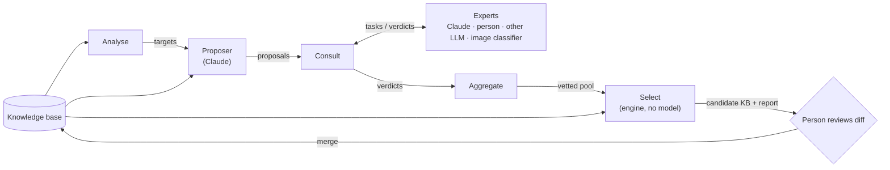

# Question design

Status: steps 0 to 3 built: `-simulate -sim-model`, the `design` package
with the Claude and human experts, `aggregate` for the answer key, `analyse`
and `propose`. Consulting on proposals, their error rates and Select are
next. Replaces the aim of [calibration-loop.md](calibration-loop.md); its
photo harness stays, as one kind of expert (see [Where the photo work
fits](#where-the-photo-work-fits)). Clouds first.

- [Why the reframe](#why-the-reframe)
- [Goal](#goal)
- [Components](#components)
- [Interfaces](#interfaces)
- [The score](#the-score)
- [Implementation](#implementation)
- [First pass: Claude as the expert](#first-pass-claude-as-the-expert)
- [Where the photo work fits](#where-the-photo-work-fits)
- [Risks](#risks)
- [Later](#later)

## Why the reframe

The calibration loop set out to tune `noise`, `confusion` and `cost` on a
fixed set of 15 questions. Its baseline (148 photos so far) says the
questions themselves are the problem, not their error rates:

- 22% right on held-out photos, 13.5 questions on average. Tuning error rates
  cannot turn that into 80% in 6.
- Two questions are unanswerable most of the time: the sun and the halo
  questions were skipped 74% and 80% of the time as "not in photo".
- Several questions carry almost nothing: anvil, pouches and the top of the
  cloud remove under 0.1 bits per ask.
- The error model is already the weak link without photos. `-simulate`
  gets all 32 clouds with honest answers, but answering as the knowledge
  base's own `noise` and `confusion` say (`-sim-model`), it identifies 44–62%
  depending on the seed, in 10.8 questions on average.

Most of the effort went into the photo corpus, the answerer and leakage
checks. Those measure a question set; nothing in the loop makes a better one.

## Goal

Find the set of questions, and each entity's answer to each, that identifies
an entity in the fewest questions a layperson can answer reliably.

1. **Propose.** Claude invents questions (attributes, their values and labels)
   and assigns every entity a value, aimed at the pairs the quiz confuses.
2. **Consult.** Experts check each proposal: is the value right for this
   entity, and can an untrained person answer the question? Every
   consultation is a closed choice among the options the proposer offered,
   so an expert can be Claude, a person, another LLM or a classifier that is
   no language model at all, behind one interface.
3. **Select.** A deterministic scorer picks the subset of questions, old and
   new, that gives the best score under the error rates the experts reported.
4. **Review.** A person reads the diff to the knowledge base and merges it.

**Non-goals.** No model at quiz time. No change to how the engine picks
questions. Entities are not added, merged or removed; granularity (32 species
or 10 genera) stays a product decision.

## Components



| Component | Does | Model | Reads | Writes |
| --- | --- | --- | --- | --- |
| Analyse | finds the entity pairs the quiz fails to separate, under a realistic error rate | no | KB | `targets.json` |
| Proposer | invents attributes aimed at the targets, and rewrites weak ones | Claude | KB, targets, prior evidence | `proposals.json` |
| Consult | turns proposals into expert tasks, sends them to each expert, caches verdicts | via experts | proposals | the verdict store |
| Expert | picks among a task's options, or abstains; knows nothing of the proposer's values or reasons | any, or none | a task | a verdict |
| Aggregate | settles each value and each question's error rates from the verdicts | no | proposals, verdicts | `pool.json`, `disputes.json` |
| Select | chooses the question set that scores best | no (Go engine) | KB, pool | `candidate.json`, `report.md` |

Each box is a subcommand of one Go binary that reads and writes files, so
any one can be rerun or replaced alone, and a person can edit any file in
between. Between the boxes the contracts are Go interfaces (see
[Implementation](#implementation)); the files are how they persist.

**Boundaries that matter**

- **The proposer never scores its own work.** Its values reach the knowledge
  base only through experts and the scorer.
- **Only the proposer writes free text.** It invents questions, values and
  labels. Experts only choose among the options it offered, or abstain for
  one of a fixed set of reasons. A rewording an expert would want is
  evidence for the next proposal round, recorded as an abstention
  (`unclear_question`), not as prose.
- **Experts answer blind.** An assignment task asks "what is Cirrus uncinus's
  value for this question?", never "is `curled` right?". Agreement is then
  counted by the aggregator. Showing the proposed value invites a yes.
- **Experts don't see each other**, or the proposer's rationale. The
  aggregator is the only place their answers meet.
- **Select is the only judge of discrimination**, and it is plain code. No
  model decides whether a question is worth keeping.

## Interfaces

All files are JSON or JSON Lines under `tools/design/runs/<date>-<label>/`.
The knowledge base format does not change.

### targets.json

```json
{"kb": "data/clouds.json", "sim_model": true, "seeds": 20,
 "pairs": [{"a": "Cirrus fibratus", "b": "Cirrus uncinus", "mixups": 14,
            "separated_by": ["hooks"]}]}
```

`mixups` counts simulated games of `a` that ended on `b` or the reverse.
`separated_by` lists the current attributes on which the two differ; a pair
separated only by noisy questions is a target as much as an inseparable one.

### proposals.json

```json
{"proposer": "claude-opus-5@propose-v1",
 "attributes": [
  {"id": "p07", "name": "hooks", "replaces": "hooks",
   "kind": "categorical",
   "question": "Did the ends of the streaks curl up, like a tick mark?",
   "values": {"none": "no streaks", "straight": "straight or gently curved",
              "curled": "curled up at one end"},
   "confusable": [["straight", "curled"]],
   "targets": [["Cirrus fibratus", "Cirrus uncinus"]],
   "rationale": "…",
   "assign": {"Cirrus fibratus": ["straight"], "Cirrus uncinus": ["curled"],
              "Cumulus humilis": ["none"]}}]}
```

- `assign` covers every entity. A list holds several values when the entity
  genuinely shows either (the engine already supports that); `"unknown"`
  marks one the proposer can't say.
- `replaces` names an existing attribute this one would stand in for, or is
  absent for a new one. The scorer never keeps both.
- Existing attributes enter the pool unchanged as proposals with
  `"proposer": "kb"`, so they are vetted and selected on the same terms.

### Tasks and verdicts

Every consultation is the same shape: **a subject, one question, and the
options the proposer offered. The expert returns a probability for each
option, and for abstaining.** Nothing else. That is what lets an expert be
anything that can put numbers on a fixed list: a language model, a person
clicking a form, or an image classifier whose output layer is those options.

**Task**

```json
{"id": "9f2c…", "kind": "assign", "attribute": "p07",
 "subject": {"entity": "Cirrus uncinus",
             "text": "Cirrus uncinus: cirrus in the form of commas, …",
             "photos": ["corpus/clouds/…/a1b2.jpg"]},
 "question": "Did the ends of the streaks curl up, like a tick mark?",
 "options": [{"value": "none", "label": "no streaks"},
             {"value": "straight", "label": "straight or gently curved"},
             {"value": "curled", "label": "curled up at one end"}],
 "max_choices": 2}
```

`subject` carries every form of the subject the harness has; each expert
reads the forms it understands and ignores the rest. A text model reads
`text`, an image classifier `photos`.

**Verdict**

```json
{"task": "9f2c…", "expert": "claude:claude-opus-5@v1a",
 "p": {"none": 0.0, "straight": 0.1, "curled": 0.9},
 "abstain": 0.0, "reason": null}
```

- `p` plus `abstain` sum to 1. A classifier gives its softmax directly; a
  person or a model picking options gives them their mass (one pick: 1.0; two
  picks: 0.5 each). How a backend turns a stated confidence into numbers is
  written down in the backend, once, not left to the model.
- `reason` is required when `abstain > 0`, from a fixed set:
  `not_observable` (can't be seen or known this way), `ambiguous` (two
  options fit and neither better), `unclear_question` (the wording is the
  problem), `unknown` (the expert doesn't know).

**Kinds.** They differ only in what the subject is, and so in what the
answer means:

| Kind | Subject | Question put to the expert | Gives |
| --- | --- | --- | --- |
| `assign` | an entity | "Which option does this entity show?" | the entity's value |
| `perceive` | an attribute's true value: "the streaks really curl up at one end" | "Which option would someone untrained, looking up for a few seconds, pick?" | one row of the question's mix-up table, and its abstain rate |
| `observe` | a photo | "Which option does this photo show?" | the same row, measured instead of estimated, once photos are grouped by their entity's value |

`perceive` replaces the free-form "is this answerable?" task. Asked once per
value of an attribute, its rows form the full table of what people answer
against what is true, which is what the engine's error model is fitted from.

**Which expert can do what.** A backend declares which kinds, and which
subject forms, it accepts; Consult routes each task only to experts that can
take it.

| Backend | `assign` | `perceive` | `observe` |
| --- | --- | --- | --- |
| `claude` (the CLI, called as `claude_cli.py` calls it) — **built first** | text | text | photo |
| `human` (a terminal prompt, like the `ribice` quiz) — **built first** | text | text | photo path |
| other LLM | text | text | photo, if it has vision |
| zero-shot image model (CLIP-style: photo scored against each option label) | via the entity's photos | — | photo |
| trained classifier (fixed option set) | via the entity's photos | — | photo, only for tasks whose options it was trained on |
| reference table (a field guide, Wikidata) | text lookup | — | — |

A photo-only expert does `assign` by answering `observe` on each of the
entity's photos and averaging; the backend does that, not Consult.

**Ids and cache**

- **Task id** is a hash of kind, attribute, subject, question and options
  in order: everything the expert is shown. A reworded question is re-asked
  and an unchanged one never is. `ReadTasks` refuses a task whose id no
  longer matches its content, so a hand-edited task is never matched with
  verdicts on its old wording.
- **Expert id** is `backend:model@version`, or `human:<name>`. The version
  names the expert's instructions (`v1a`: prompt set 1, wording a), so
  changing a prompt makes a new expert rather than mixing old and new
  answers. Two experts never share a cache row.
- A backend implements the `Expert` interface (see
  [Implementation](#implementation)). It may batch: the Claude backend puts
  all of one entity's `assign` tasks, or all of one attribute's `perceive`
  tasks, into one call, and still returns one verdict per task.

### pool.json

The proposals with every value settled, and error rates filled in. Verdicts
are combined by averaging `p` and `abstain` across experts, one vote per
expert however many prompt variants it has:

- **Value.** Kept when the proposer's value is the combined `p`'s top option
  and holds more than half its mass (for a two-valued entity, both values
  together); an even split backs nothing. Where the proposer gave no value,
  the experts' top option is taken if it holds more than half on its own. Otherwise the value is *disputed*: its `assign` task goes to
  `disputes.json`, and the attribute is held out of selection until the
  dispute is settled. Settling it is one more consultation: the `human`
  expert answers the disputed tasks, blind like any other, and a person's
  verdict outweighs the rest (see [First pass](#first-pass-claude-as-the-expert)). An `assign` abstention of `not_observable` on more than a
  quarter of entities drops the attribute.
- **Mix-up table.** The combined `perceive` rows, true value against
  answered value; `observe` rows replace them where photos measured them.
- **`confusable`**: pairs where either direction gets at least 10% of
  answers. **`confusion`**: mean share landing on a declared look-alike.
  **`noise`**: mean share landing elsewhere, floored at 0.02.
- **`answer_rate`**: 1 − mean abstain. **`cost`**: `1 / answer_rate`,
  clamped to 0.7–3.0, so a question few people can answer is asked late.
  `answer_rate` under 0.5 drops the attribute from the pool.

## The score

Select plays `-simulate` with the simulated user making mistakes the way each
attribute's own error model says (`Attribute.Report`), rather than one flat
`-sim-noise`, and skipping at the attribute's `1 − answer_rate`. Over 20 seeds:

- **score = accuracy in percent − 5 × mean questions**, as in the calibration
  loop, so one question saved is worth 5 points of accuracy;
- plus a floor: no subset whose accuracy drops below the current KB's.

Selection is greedy: start from the current attributes, then repeatedly apply
the single add, drop or replace that raises the score most, until none does.
A full simulation of 32 entities takes milliseconds, so trying every move in
a pool of 50 for 20 seeds is seconds.

This makes the error model the lever that decides what gets selected, so the
`perceive` estimates must be honest. The photo answerer is the
check on that (below).

**Engine change (done).** `SimOptions.ErrorModel`, `-simulate -sim-model` on
the command line: each simulated answer is drawn from
`Attribute.Report(·, truth)`, and each question is unanswerable for a share
`1 − answer_rate` of games, a new optional knowledge-base field (default 1;
`-lint` warns below 0.5). Whether a question can be answered is settled once
per game, and a game with only unanswerable questions left ends as given up,
as in `-replay`. Select calls `engine.Simulate` in-process.

## Implementation

Go, in this module, with no new dependencies. The engine and `kb` are used
in-process: Select plays thousands of simulated games per run, and building
candidate knowledge bases, fitting error rates and linting all reuse `kb`
directly. The Python photo tools in `tools/calib/` stay as they are; the
first pass needs them only for gate 4.

**Packages**

| Package | Holds | Imports a model? |
| --- | --- | --- |
| `design` | the types and interfaces below; building tasks from proposals; the verdict store; Analyse, Aggregate, Select | no |
| `design/claude` | the CLI call (a port of `claude_cli.py`), the Claude `Expert` and the Claude `Proposer`, prompts embedded with `embed` | Claude, through `claude -p` |
| `design/human` | the terminal `Expert` | no |
| `internal/prompt` | reading "2", "1,3" into picks, moved out of `cmd/ribice` so the quiz and the human expert share it | no |
| `cmd/ribice-design` | subcommands `tasks`, `consult` (built), `analyse`, `propose`, `aggregate`, `select` | via the packages |

`cmd/wasm` never imports `design`, so the widget does not grow.

**Interfaces** (in `design`)

```go
type Kind string // "assign", "perceive", "observe"

type Reason string // "not_observable", "ambiguous", "unclear_question", "unknown"

type Option struct {
	Value kb.Value
	Label string
}

// Subject is what a task is about, in every form the harness has; an expert
// reads the forms it understands.
type Subject struct {
	Entity string   // assign: whose value is asked
	Value  kb.Value // perceive: the true value
	Text   string   // what a reader is told
	Photos []string // what a viewer is shown
}

type Task struct {
	ID         string // hash of kind, attribute, subject, question and options
	Kind       Kind
	Attribute  string // proposal id
	Subject    Subject
	Question   string
	Options    []Option
	MaxChoices int // for experts that pick; a classifier may spread p over all options
}

type Verdict struct {
	Task    string
	Expert  string
	P       map[kb.Value]float64
	Abstain float64
	Reason  Reason // set exactly when Abstain > 0
}

// Check reports whether v is a well-formed answer to t: p over t's options
// only, p and Abstain summing to 1, and a reason exactly when abstaining.
func (v Verdict) Check(t Task) error

// Expert answers tasks. Answer calls emit once per verdict, as soon as it is
// ready, so an interrupted run keeps everything answered so far. A task it
// did not get to is simply left out and asked on the next run.
type Expert interface {
	ID() string // "claude:claude-opus-5@v1a", "human:luka"
	Accepts(Task) bool
	Answer(ctx context.Context, tasks []Task, emit func(Verdict) error) error
}

// Proposer invents attributes. It is the only component that writes free text.
type Proposer interface {
	Propose(ctx context.Context, b Brief) ([]Proposal, error)
}

// Store keeps every verdict ever given, keyed by task and expert.
type Store interface {
	Get(task, expert string) (Verdict, bool)
	Put(Verdict) error
}
```

`Brief` is the knowledge base, `targets.json` and the photo evidence;
`Proposal` is one entry of `proposals.json`. The verdict store is an
append-only JSON Lines file, `tools/design/verdicts.jsonl`, committed:
a person's answers are too costly to lose to a cleaned cache.

`Picks(options []Option, picks []int, c Confidence) map[kb.Value]float64`
turns chosen options into `p` with the table above (high 1.0, medium 0.8,
low 0.5 on the picks). Both backends below use it, so a person and Claude
answering the same way give the same verdict.

### The Claude backend

`design/claude` calls `claude -p` exactly as `claude_cli.py` does today:

- our system prompt replaces Claude Code's, `--tools ""`, `--setting-sources
  ""`, `--strict-mcp-config`, `--no-session-persistence`, run in an empty
  temporary directory;
- the user turn goes in as stream-json, images as content blocks, never file
  paths;
- the reply is enforced with `--json-schema`, whose schema allows only
  option numbers, a confidence and an abstention reason;
- each call's `rate_limit_event` reports the five-hour window, and a shared
  pool stops starting calls at 80%, leaving the rest to the person; the run
  then stops with what it has, and the next run asks only what is missing;
- a reply that fails the schema or `Verdict.Check` is retried once, then left
  out.

One `Expert` value per prompt variant (`v1a`, `v1b`, `v1c`), each its own
expert id; `observe` has one wording so far. It batches: one call per entity
for `assign`, one per attribute for `perceive`, one per photo for `observe`,
with a shared rules text per kind and only the framing worded differently.
The Proposer is the same caller with the proposer prompt at effort `high`.

The reply schemas:

- `assign` and `observe`: per question, up to two option numbers, a
  confidence, and an abstain reason or null; turned into `p` by `Picks`.
- `perceive`: per case, how many of ten untrained people pick each option,
  how many cannot answer, and the main reason if any; `p` is the counts over
  ten. A mix-up row is a distribution, so it is asked for as one, rather
  than as a single pick with a confidence.

A live call on one cloud's 15 `assign` tasks took one call and about $0.04
at API prices.

**The current answer key, vetted first** (2026-09-27,
`tools/design/runs/2026-09-27-assign-current/`). The 15 current questions
for all 32 clouds, in all three wordings: 96 calls, about $3.09 at API
prices. The experts back 385 of 480 values and dispute 95. Most disputes are
the questions' fault: `depth` offers "flat or layered, not a heap" beside
"much wider than it was tall", `element_size` calls a whole cumulus "no
separate lumps", and `base` offers "no clear bottom, it faded out" beside
"you could not make one out". Some look like wrong values, such as virga on
Cirrus uncinus. Its `settled.md` is evidence for the proposer.

The API and Batch paths of `backends.py` are not ported. They pay off on
photo-heavy runs, and the first pass has none.

### The human backend

`design/human` asks a person in the terminal, one task at a time, in the
style of the `ribice` quiz:

```text
[assign 12/40]  Cirrus uncinus
Cirrus in the form of commas, ending in a hook or a tuft.

Did the ends of the streaks curl up, like a tick mark?
   1) no streaks
   2) straight or gently curved
   3) curled up at one end
> 3

keys: a number, or two (1,3); add ? if unsure (3?)
      (n)ot observable  (a)mbiguous  (c) unclear question  (d)on't know
      (b)ack  (q)uit
```

- A pick becomes `p` through `Picks`, at high confidence, or low with `?`.
  An abstention is all-or-nothing: `Abstain` 1 with the key's reason.
- `observe` tasks print the photo's path, and with `-open` hand it to the
  desktop's image viewer.
- Each answer is emitted, and so stored, as it is given; `q` stops, and the
  next run starts at the first unanswered task. `b` re-asks the previous task
  and replaces its verdict.
- The expert id is `human:<name>`, from `-as`. Reading and writing go through
  an `io.Reader` and `io.Writer`, so tests drive it with a script of answers.
- It never shows another expert's verdict or the proposer's value; `assign`
  tasks for a dispute look exactly like any other.

## First pass: Claude as the expert

One pass on clouds, every expert role played by Claude, run through the CLI on
the subscription, with you as the `human` expert only for the disputes. The
point is to exercise every interface end to end and see whether the score
moves; until gate 4 its numbers are Claude checking Claude, not truth.

| Step | Command | Claude calls | Rough size |
| --- | --- | --- | --- |
| 0. Engine | `-simulate -sim-model`, `answer_rate` | — | done |
| 1. Backends | `design`, `design/claude`, `design/human`, `ribice-design tasks` and `consult`, with tests | — | done |
| 2. Analyse | `ribice-design analyse -kb data/clouds.json -out targets.json` | none | done: 48% identified in 11.1 questions, score −7.3; 111 pairs mixed up |
| 3. Propose | `ribice-design propose -targets targets.json -evidence settled.md,report.md -domain clouds -out proposals.json` | 1 at effort `high` | up to 25 candidate attributes, each with 32 values |
| 4. Consult: assign | `ribice-design tasks -proposals proposals.json -kind assign`, then `consult -tasks … -expert claude -variant all -domain clouds` | 32 (one per entity) × 3 variants | ~100 text calls |
| 5. Consult: perceive | `ribice-design consult -tasks perceive.jsonl -expert claude -variant all -domain clouds` | 1 per candidate × 3 variants | ~90 short calls |
| 6. Aggregate | `ribice-design aggregate` | none | `pool.json`, `disputes.json` |
| 7. Settle disputes | `ribice-design consult -tasks disputes.json -expert human -as luka` | none | you, one sitting |
| 8. Aggregate, select | `ribice-design aggregate && ribice-design select` | none | `candidate.json`, `report.md` |
| 9. Photo check | `tools/calib/run.py` on `candidate.json`, then `compare.py` | ~1 per photo, new questions only | gate 4 |
| 10. Review | you | — | the diff to `data/clouds.json` |

The three prompt variants of each task stand in for three experts: each is
its own call and its own expert id, so they are at least not one sample
repeated. Steps 3 to 5 need no photo, so they are far cheaper than the
baseline's answer matrix: estimated well under one five-hour window.

**Proposer prompt, in outline.** You design questions for a quiz that
identifies clouds for people with no training. Here are the 32 clouds with
their notes, the current questions and each cloud's answers, the pairs the
quiz confuses, and what we learnt from photos (which questions were
unanswerable, which carried nothing). Propose questions that separate the
target pairs, answerable by looking up at the sky for a few seconds without
instruments or vocabulary. Prefer one question that splits many pairs to one
per pair. You may rewrite an existing question. For each, give every cloud's
value; use `unknown` rather than guess.

**The `assign` expert** gets the cloud's name and WMO description only, and
the questions as a layperson would see them; it never sees the proposer's
values, rationale, or other clouds' answers.

**The `perceive` expert** gets one true value described in plain words, the
question and its options, never a cloud name, and says how ten different
untrained people would answer.

**Every Claude expert replies in closed form**, with the schemas above and
no free-text field. The existing `ask.py` reply already has this shape once its
`looked_at` sentence is dropped, so the photo answerer can later become an
`observe` expert with only a converter.

**Gate.** The pass is a success if:

1. every component ran and its files read as intended;
2. the disputes take one sitting (under ~40 tasks);
3. the candidate beats the current KB on the score by at least 5 points in
   simulation, with the per-attribute error rates the experts gave;
4. on the photo baseline, replayed with fresh answers for the new questions
   only, the candidate does not do worse than the current KB.

Check 4 is the only one not built on Claude's own opinion, so it decides
whether the candidate is merged.

## Where the photo work fits

Nothing built for the calibration loop is thrown away; it moves down a level.

- **The photo answerer is the `observe` expert.** It turns a question into
  measured mix-up rows and skip rates on real photos, the empirical check on
  the `perceive` estimates. Its measured rates can replace the estimated
  ones in `pool.json` for any question it has answered.
- **The baseline report is input to the proposer.** Which questions went
  unanswered and which carried no gain is exactly the evidence it needs.
- **`-replay` and `compare.py`** stay the final test of a candidate (gate 4).
- **Calibration of error rates** (phase 1c) is folded into Aggregate: rates
  come from `perceive` verdicts, or from `observe` where measured.
- Finishing the baseline (87 photos unanswered) is no longer on the critical
  path; 148 photos are enough to act as gate 4 for the first pass.

## Risks

| Risk | Mitigation |
| --- | --- |
| Claude checking Claude shares its blind spots | blind tasks, varied prompts; the photo gate; people, other models and image classifiers plug in through the same interface in later passes |
| The scorer rewards what the error model rewards; optimistic `perceive` estimates select unanswerable questions | photo `observe` rates override estimates; gate 4 |
| Values that are true of the textbook cloud but not visible to a layperson | `assign` asks about what an observer sees, not the definition, and may abstain `not_observable`; `perceive` covers the question itself |
| Greedy selection overfits the 32 entities | the accuracy floor, `-lint`, and a person reading each accepted question |
| Many new questions each with a small gain | score charges 5 points a question; greedy drops as well as adds |

## Later

- **More people as experts.** The terminal expert serves one person at a
  keyboard; a page (like `human_page.py`) writing the same verdicts would let
  others answer: `assign` for someone who knows clouds, `perceive` and
  `observe` for someone who doesn't.
- **Other models** as `assign` experts, to break Claude's shared biases.
- **Image classifiers** as `observe` experts: a zero-shot model scoring each
  photo against the option labels needs no training and handles any
  proposal; a model trained per attribute is stronger but only for option
  sets it has seen. Either gives mix-up rows from pixels alone, with no
  chance of recalling the textbook, which is the leakage the photo answerer
  could never rule out.
- **An `exec` backend**: any command that reads tasks as JSON Lines on its
  standard input and writes verdicts on its standard output. That is how an
  image classifier, most likely written in Python, plugs in without the Go
  side changing.
- **The API and Batch paths** in `design/claude`, for photo-heavy runs.
- **Fish and dogs**, on the same code: nothing above is specific to clouds
  but the prompts' wording.
