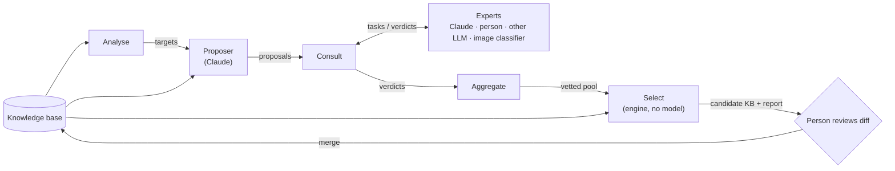

# Question design

Status: every step is built, and two rounds on clouds are merged
(2026-09-27). Round one replaced three questions and dropped one. Round two
changed no question: it settled round one's disputes by hand and replaced
every question's guessed error rates with measured ones, which put the quiz
at 60% of clouds named in 8.5 questions. Round three's proposals are being
made; the photo check has not run yet. See [Rounds so far](#rounds-so-far).

Replaces the aim of [calibration-loop.md](calibration-loop.md); its photo
harness stays, as one kind of expert (see [Where the photo work
fits](#where-the-photo-work-fits)). Clouds first.

- [Why the reframe](#why-the-reframe)
- [Goal](#goal)
- [How rounds build on each other](#how-rounds-build-on-each-other)
- [Components](#components)
- [Interfaces](#interfaces)
- [The score](#the-score)
- [Implementation](#implementation)
- [Running a round](#running-a-round)
- [Rounds so far](#rounds-so-far)
- [How the Claude experts are asked](#how-the-claude-experts-are-asked)
- [Where the photo work fits](#where-the-photo-work-fits)
- [Risks](#risks)
- [Later](#later)

## Why the reframe

The calibration loop set out to tune `noise`, `confusion` and `cost` on a
fixed set of 15 questions. Its baseline (148 photos so far) says the
questions themselves are the problem, not their error rates:

- 22% right on held-out photos, 13.5 questions on average. Tuning error rates
  cannot turn that into 80% in 6.
- Two questions are unanswerable most of the time: the sun and the halo
  questions were skipped 74% and 80% of the time as "not in photo".
- Several questions carry almost nothing: anvil, pouches and the top of the
  cloud remove under 0.1 bits per ask.
- The error model is already the weak link without photos. `-simulate`
  gets all 32 clouds with honest answers, but answering as the knowledge
  base's own `noise` and `confusion` say (`-sim-model`), it identifies 44–62%
  depending on the seed, in 10.8 questions on average.

Most of the effort went into the photo corpus, the answerer and leakage
checks. Those measure a question set; nothing in the loop makes a better one.

## Goal

Find the set of questions, and each entity's answer to each, that identifies
an entity with the least reading, in questions a layperson can answer
reliably. Reading is every word of every question asked and of every option
offered with it: a yes/no of a few words is cheap, eight long options are
not. No question offers more than five answers.

1. **Propose.** Claude invents questions (attributes, their values and labels)
   and assigns every entity a value, aimed at the pairs the quiz confuses.
2. **Consult.** Experts check each proposal: is the value right for this
   entity, and can an untrained person answer the question? Every
   consultation is a closed choice among the options the proposer offered,
   so an expert can be Claude, a person, another LLM or a classifier that is
   no language model at all, behind one interface.
3. **Select.** A deterministic scorer picks the subset of questions, old and
   new, that gives the best score under the error rates the experts reported.
4. **Review.** A person reads the diff to the knowledge base and merges it.

**Non-goals.** No model at quiz time. No change to how the engine picks
questions. Entities are not added, merged or removed; granularity (32 species
or 10 genera) stays a product decision.

## How rounds build on each other

The knowledge bases were written by a language model in one go. Their
questions are plausible and their answers are what a textbook would say, but
nothing checked that people can answer those questions or that the answers
are what an observer sees. `-simulate` could not tell, because its simulated
user answers straight from the JSON. The loop above exists to fix that, and it
is meant to be run again and again, each round starting from the last one's
result:

- **The baseline moves.** A round's winning questions are merged, so the next
  `analyse` scores the improved knowledge base and targets the confusions
  that are left, not ones already fixed.
- **Knowledge accumulates.** Every verdict stays in
  `tools/design/verdicts.jsonl`, keyed by what the expert was shown, and is
  never asked for again. A question kept across rounds collects more experts
  and kinds of evidence (`assign`, `perceive`, `observe`), so its values move
  from proposed to vetted, and its error rates from guessed to measured.
- **The measure improves with the knowledge base.** Select judges a round by
  simulated games played with each question's error rates. The better those
  rates are measured, the more a higher score means a better quiz. Running
  `perceive` on questions that predate the loop brings them onto the same
  footing as proposals.
- **Evidence feeds the next proposer.** What experts disputed, which
  questions lost in Select and why, and what photos showed all go into the
  next `propose` call.
- **People are spent where it matters.** A person settles only the disputed
  values on questions that won, and reviews one diff per round.
- **It never gets worse by its own measure.** Select keeps nothing that does
  not raise the score by 2 points on 100 seeds, lowers accuracy, loses an
  entity the current questions can name with perfect answers, or leaves
  more entities answering every question alike. Because that measure is partly Claude's
  opinion, the photo check and people are what keep it honest; as
  more expert kinds join, less of the measure rests on any one of them.

A round is a few hundred CLI calls, most of one five-hour window, and one
sitting for a person. Rounds can stop whenever the score stops moving; the
quiz is usable after every one.

## Components



| Component | Does | Model | Reads | Writes |
| --- | --- | --- | --- | --- |
| Analyse | finds the entity pairs the quiz fails to separate, under a realistic error rate | no | KB | `targets.json` |
| Proposer | invents attributes aimed at the targets, and rewrites weak ones | Claude | KB, targets, prior evidence | `proposals.json` |
| Consult | turns proposals into expert tasks, sends them to each expert, caches verdicts | via experts | proposals | the verdict store |
| Expert | picks among a task's options, or abstains; knows nothing of the proposer's values or reasons | any, or none | a task | a verdict |
| Aggregate | settles each value and each question's error rates from the verdicts | no | proposals, verdicts | `settled.md`, `disputes.jsonl`, `pool.json`, `pool.md` |
| Select | brings the current questions up to date, then chooses the question set that scores best | no (Go engine) | KB, pool, perceive verdicts | `candidate.json`, `select.md`, `select.json`, `settle.jsonl` |

Each box is a subcommand of one Go binary that reads and writes files, so
any one can be rerun or replaced alone, and a person can edit any file in
between. Between the boxes the contracts are Go interfaces (see
[Implementation](#implementation)); the files are how they persist.

**Boundaries that matter**

- **The proposer never scores its own work.** Its values reach the knowledge
  base only through experts and the scorer.
- **Only the proposer writes free text.** It invents questions, values and
  labels. Experts only choose among the options it offered, or abstain for
  one of a fixed set of reasons. A rewording an expert would want is
  evidence for the next proposal round, recorded as an abstention
  (`unclear_question`), not as prose.
- **Experts answer blind.** An assignment task asks "what is Cirrus uncinus's
  value for this question?", never "is `curled` right?". Agreement is then
  counted by the aggregator. Showing the proposed value invites a yes.
- **Experts don't see each other**, or the proposer's rationale. The
  aggregator is the only place their answers meet.
- **Select is the only judge of discrimination**, and it is plain code. No
  model decides whether a question is worth keeping.

## Interfaces

All files are JSON or JSON Lines under `tools/design/runs/<date>-<label>/`.
The knowledge base format does not change.

### targets.json

```json
{"kb": "data/clouds.json", "seeds": 40,
 "score": {"games": 1280, "accuracy": 0.60, "questions": 8.5, "gave_up": 0, "score": 17.5},
 "pairs": [{"a": "Cirrus fibratus", "b": "Cirrus uncinus", "mixups": 18,
            "separated_by": ["hooks"]}],
 "missed": [{"entity": "Stratocumulus castellanus", "rate": 0.8}]}
```

Games are played with each question's error model (`-sim-model`), one per
entity per seed. `mixups` counts games of `a` that ended on `b` or the
reverse. `separated_by` lists the attributes on which the two never give the
same answer; a pair separated only by noisy questions is a target as much as
an inseparable one. `missed` is how often each entity was not named.

### proposals.json

```json
{"proposer": "claude:claude-opus-5@propose-v1", "kb": "data/clouds.json",
 "attributes": [
  {"id": "p07", "proposer": "claude:claude-opus-5@propose-v1",
   "name": "streak_ends", "replaces": "hooks", "kind": "categorical",
   "question": "Did the ends of the streaks curl up, like a tick mark?",
   "values": [{"value": "none", "label": "no streaks"},
              {"value": "straight", "label": "straight or gently curved"},
              {"value": "curled", "label": "curled up at one end"}],
   "confusable": [["straight", "curled"]],
   "targets": [["Cirrus fibratus", "Cirrus uncinus"]],
   "rationale": "…",
   "assign": {"Cirrus fibratus": ["straight"], "Cirrus uncinus": ["curled"],
              "Cumulus humilis": ["none"]}}]}
```

- `assign` covers every entity. A list holds two values when the entity
  genuinely shows either (the engine already supports that); an empty list
  marks one the proposer can't say, which the experts then fill in.
- `replaces` names a current question this one would stand in for, or is
  absent for a new one. Select never keeps both. Reusing a current
  question's name means replacing it.
- `propose` checks every question against the knowledge base and drops just
  the ones that miss an entity, assign one twice or use a value they did not
  declare.
- Current questions are not proposals. Select brings them up to date itself
  (see [The score](#the-score)): re-fitting their error rates from
  `perceive`, and rewriting a merged question from its newer pool entry.

### Tasks and verdicts

Every consultation is the same shape: **a subject, one question, and the
options the proposer offered. The expert returns a probability for each
option, and for abstaining.** Nothing else. That is what lets an expert be
anything that can put numbers on a fixed list: a language model, a person
clicking a form, or an image classifier whose output layer is those options.

**Task**

```json
{"id": "9f2c…", "kind": "assign", "attribute": "streak_ends",
 "subject": {"entity": "Cirrus uncinus",
             "text": "Filaments drawn out into a hook or comma at one end."},
 "question": "Did the ends of the streaks curl up, like a tick mark?",
 "options": [{"value": "none", "label": "no streaks"},
             {"value": "straight", "label": "straight or gently curved"},
             {"value": "curled", "label": "curled up at one end"}],
 "max_choices": 2}
```

`subject` carries every form of the subject the harness has; each expert
reads the forms it understands and ignores the rest. A text model reads
`text`, an image classifier `photos`. `attribute` is the question's name.
Photos an expert is shown only for context, such as a person's reference
photos of the entity, are added by that expert and never put in the task,
so its id stays the same for every expert asked it.

**Verdict**

```json
{"task": "9f2c…", "expert": "claude:claude-opus-5@v2a",
 "p": {"none": 0.0, "straight": 0.1, "curled": 0.9},
 "abstain": 0.0, "reason": null}
```

- `p` plus `abstain` sum to 1. A classifier gives its softmax directly; a
  person or a model picking options gives them their mass (one pick: 1.0; two
  picks: 0.5 each). How a backend turns a stated confidence into numbers is
  written down in the backend, once, not left to the model.
- `reason` is required when `abstain > 0`, from a fixed set:
  `not_observable` (can't be seen or known this way), `ambiguous` (two
  options fit and neither better), `unclear_question` (the wording is the
  problem), `unknown` (the expert doesn't know).

**Kinds.** They differ only in what the subject is, and so in what the
answer means:

| Kind | Subject | Question put to the expert | Gives |
| --- | --- | --- | --- |
| `assign` | an entity | "Which option does this entity show?" | the entity's value |
| `perceive` | an attribute's true value: "the streaks really curl up at one end" | "Which option would someone untrained, looking up for a few seconds, pick?" | one row of the question's mix-up table, and its abstain rate |
| `observe` | a photo | "Which option does this photo show?" | the same row, measured instead of estimated, once photos are grouped by their entity's value |

`perceive` replaces the free-form "is this answerable?" task. Asked once per
value of an attribute, its rows form the full table of what people answer
against what is true, which is what the engine's error model is fitted from.

**Which expert can do what.** A backend declares which kinds, and which
subject forms, it accepts; Consult routes each task only to experts that can
take it.

| Backend | `assign` | `perceive` | `observe` |
| --- | --- | --- | --- |
| `claude` (the CLI, called as `claude_cli.py` calls it) — **built first** | text | text | photo |
| `human` (a terminal prompt, like the `ribice` quiz) — **built first** | text, with the entity's photos | text | photo |
| other LLM | text | text | photo, if it has vision |
| zero-shot image model (CLIP-style: photo scored against each option label) | via the entity's photos | — | photo |
| trained classifier (fixed option set) | via the entity's photos | — | photo, only for tasks whose options it was trained on |
| reference table (a field guide, Wikidata) | text lookup | — | — |

A photo-only expert does `assign` by answering `observe` on each of the
entity's photos and averaging; the backend does that, not Consult.

**Ids and cache**

- **Task id** is a hash of kind, attribute, subject, question and options
  in order: everything the expert is shown. A reworded question is re-asked
  and an unchanged one never is. `ReadTasks` refuses a task whose id no
  longer matches its content, so a hand-edited task is never matched with
  verdicts on its old wording.
- **Expert id** is `backend:model@version`, or `human:<name>`. The version
  names the expert's instructions (`v2a`: prompt set 2, wording a), so
  changing a prompt makes a new expert rather than mixing old and new
  answers. Two experts never share a cache row. Where one expert answered a
  task under several versions, only the latest counts (`Latest`): a revised
  prompt corrects the old one rather than adding a second opinion.
- A backend implements the `Expert` interface (see
  [Implementation](#implementation)). It may batch: the Claude backend puts
  all of one entity's `assign` tasks, or all of one attribute's `perceive`
  tasks, into one call, and still returns one verdict per task.

### pool.json

The proposals with every value settled, and error rates filled in. Verdicts
are combined by averaging `p` and `abstain`, one vote per expert id (each
prompt wording counts as an expert). Each value ends in one status:

- **agreed**: the proposer's value is the combined `p`'s top option and
  holds more than half its mass (for a two-valued entity, both values
  together); an even split backs nothing. Where the proposer gave no value,
  the experts' top option is taken if it holds more than half on its own.
- **corrected**: a person answered, with another value. Once a person has
  answered a task, only people's verdicts count, and what they answered is
  the value. Settling a dispute is one more consultation: the `human` expert
  answers the disputed tasks, blind like any other.
- **disputed**: the models lean elsewhere. The task goes to
  `disputes.jsonl`; the proposer's value stands until a person settles it.
- **abstained**: at least half the answer is abstention.

A question with values still disputed or abstained is not ready. Select
uses it only with `-allow-disputed`, and then lists those values in
`settle.jsonl`, so a person settles only the disputes on questions that
won. A question most experts call not observable for more than a quarter of
entities, or that under half the people could answer, is never used.
- **Mix-up table.** The combined `perceive` rows, true value against
  answered value; `observe` rows replace them where photos measured them.
- **`confusable`**: pairs where either direction gets at least 20% of
  answers, two people in ten: at 10%, one imagined outlier made a pair. **`confusion`**: mean share landing on a declared look-alike.
  **`noise`**: mean share landing elsewhere, floored at 0.02.
- **`answer_rate`**: 1 − mean abstain. `answer_rate` under 0.5 drops the
  attribute from the pool.
- **`cost`**: the question's reading effort over the options people are
  offered, divided by `answer_rate`, clamped to 0.5–6. Reading effort is the
  words of the question plus, per option, its words and 2 more for weighing
  it, in units of 12 words (a short yes/no). The engine ranks questions by
  gain over cost, so a long or hard question is asked only when worth it.
  Select works a pool entry's cost out afresh when it uses it, so a pool
  written under an older formula cannot carry a stale one.

## The score

Select plays `-simulate` with the simulated user making mistakes the way each
attribute's own error model says (`Attribute.Report`), rather than one flat
`-sim-noise`, and skipping at the attribute's `1 − answer_rate`:

- **score = accuracy in percent − 5 points per 12 words read**, averaged
  over games. A game's reading is every question asked and the options
  offered with it, "something else" included, so a short yes/no costs what
  a question cost when the score counted questions, and eight long options
  cost several times that. Games are played as the site plays them, with at
  most 5 answers offered at once (the engine's `MaxOptions`).
- **At most 5 answers** per question: the proposer is asked for that,
  `propose` rejects more, and Select never adds a question with more. A
  current question over the limit stays only until something shorter does
  its work; `select.md` lists it for the next proposer.

**Before searching**, Select brings the current knowledge base up to date, so
the score it starts from is measured the same way as the candidates':

- `-refresh` (on by default) rewrites each question the knowledge base
  shares with the pool from its pool entry: settled values, including a
  person's corrections, and fitted error rates.
- `-refit perceive.jsonl,…` re-fits the error rates of the other current
  questions from `perceive` verdicts on them. A question lacking answers for
  any value keeps its rates, and the report says so.

**The search** is greedy: start from the current questions, then take the
single add, drop or replace that raises the score most, until none does.
Every move is screened on 10 games per entity (`-seeds`); the three most
promising are confirmed on 100 (`-confirm-seeds`), and one is taken only if
it gains at least 2 points there (`-min-gain`). At 10 seeds the score
wanders by about 3 points on chance alone: unconfirmed, round two took a
"gain" of 4.3 that was a loss of 1.5 on 40 seeds. Reported scores are the
confirmed ones. A move is never taken if the candidate would

- fail to load or `-lint` with an error;
- identify fewer entities than the starting point does (accuracy floor);
- identify fewer with perfect answers (`-simulate`): an error model can hide
  a question set that cannot separate two entities at all;
- leave more entities answering every question alike (`kb.Inseparable`).

A search over 15 proposals and 14 current questions takes under a minute.

This makes the error model the lever that decides what gets selected, so the
`perceive` estimates must be honest. People, and the photo answerer, are the
check on that.

**Engine change (done).** `SimOptions.ErrorModel`, `-simulate -sim-model` on
the command line: each simulated answer is drawn from
`Attribute.Report(·, truth)`, and each question is unanswerable for a share
`1 − answer_rate` of games, a new optional knowledge-base field (default 1;
`-lint` warns below 0.5). Whether a question can be answered is settled once
per game, and a game with only unanswerable questions left ends as given up,
as in `-replay`. Select calls `engine.Simulate` in-process.

## Implementation

Go, in this module, with no new dependencies. The engine and `kb` are used
in-process: Select plays thousands of simulated games per run, and building
candidate knowledge bases, fitting error rates and linting all reuse `kb`
directly. The Python photo tools in `tools/calib/` stay as they are; the
loop needs them only for the photo check.

**Packages**

| Package | Holds | Imports a model? |
| --- | --- | --- |
| `design` | the types and interfaces below; building tasks; the verdict store; Analyse, Settle, FitErrors, BuildPool, Refit, Select; KBFile, which edits a knowledge base's JSON in place so a diff shows only what changed | no |
| `design/claude` | the CLI call (a port of `claude_cli.py`), the Claude `Expert` and the Claude `Proposer`, prompts embedded with `embed` | Claude, through `claude -p` |
| `design/human` | the terminal `Expert`, with photos of the entity on request | no |
| `internal/prompt` | reading "2", "1,3" into picks, moved out of `cmd/ribice` so the quiz and the human expert share it | no |
| `cmd/ribice-design` | subcommands `analyse`, `propose`, `tasks`, `consult`, `aggregate`, `select` | via the packages |

`cmd/wasm` never imports `design`, so the widget does not grow.

**Interfaces** (in `design`)

```go
type Kind string // "assign", "perceive", "observe"

type Reason string // "not_observable", "ambiguous", "unclear_question", "unknown"

type Option struct {
	Value kb.Value
	Label string
}

// Subject is what a task is about, in every form the harness has; an expert
// reads the forms it understands.
type Subject struct {
	Entity string   // assign: whose value is asked
	Value  kb.Value // perceive: the true value
	Text   string   // what a reader is told
	Photos []string // what a viewer is shown
}

type Task struct {
	ID         string // hash of kind, attribute, subject, question and options
	Kind       Kind
	Attribute  string // the question's name
	Subject    Subject
	Question   string
	Options    []Option
	MaxChoices int // for experts that pick; a classifier may spread p over all options
}

type Verdict struct {
	Task    string
	Expert  string
	P       map[kb.Value]float64
	Abstain float64
	Reason  Reason // set exactly when Abstain > 0
}

// Check reports whether v is a well-formed answer to t: p over t's options
// only, p and Abstain summing to 1, and a reason exactly when abstaining.
func (v Verdict) Check(t Task) error

// Expert answers tasks. Answer calls emit once per verdict, as soon as it is
// ready, so an interrupted run keeps everything answered so far. A task it
// did not get to is simply left out and asked on the next run.
type Expert interface {
	ID() string // "claude:claude-opus-5@v2a", "human:luka"
	Accepts(Task) bool
	Answer(ctx context.Context, tasks []Task, emit func(Verdict) error) error
}

// Proposer invents attributes. It is the only component that writes free text.
type Proposer interface {
	Propose(ctx context.Context, b Brief) ([]Proposal, error)
}

// Store keeps every verdict ever given, keyed by task and expert.
type Store interface {
	Get(task, expert string) (Verdict, bool)
	Put(Verdict) error
}
```

`Brief` is the knowledge base, the mixed-up pairs from `targets.json` and
evidence files in prose (`settled.md`, `pool.md`, `select.md`, a person's
notes);
`Proposal` is one entry of `proposals.json`. The verdict store is an
append-only JSON Lines file, `tools/design/verdicts.jsonl`, committed:
a person's answers are too costly to lose to a cleaned cache.

`Picks(options []Option, picks []int, c Confidence) map[kb.Value]float64`
turns chosen options into `p` with the table above (high 1.0, medium 0.8,
low 0.5 on the picks). Both backends below use it, so a person and Claude
answering the same way give the same verdict.

### The Claude backend

`design/claude` calls `claude -p` exactly as `claude_cli.py` does today:

- our system prompt replaces Claude Code's, `--tools ""`, `--setting-sources
  ""`, `--strict-mcp-config`, `--no-session-persistence`, run in an empty
  temporary directory;
- the user turn goes in as stream-json, images as content blocks, never file
  paths;
- the reply is enforced with `--json-schema`, whose schema allows only
  option numbers, a confidence and an abstention reason;
- each call's `rate_limit_event` reports the five-hour window, and a shared
  pool stops starting calls at 80%, leaving the rest to the person; the run
  then stops with what it has, and the next run asks only what is missing;
- a reply that fails the schema or `Verdict.Check` is retried once, then left
  out.

One `Expert` value per prompt variant (`v2a`, `v2b`, `v2c`; `-variant all`
runs all three), each its own expert id; `observe` has one wording so far.
It batches: one call per entity for `assign`, one per attribute for
`perceive`, one per photo for `observe`, with a shared rules text per kind
and only the framing worded differently. The Proposer is the same caller
with the proposer prompt at effort `high`. With a `Progress` callback, a
call streams its output and reports thinking and answer characters about
once a second; `propose` shows it.

**Models and cost.** Experts run on `claude-opus-5` at effort `low`, the
proposer on `claude-opus-5` at effort `high`; `-model` and `-effort` change
either. Measured at API prices, though the subscription pays: an `assign`
pass over 15 questions and 32 entities in three wordings, 96 calls, about
$3.10; `perceive` on 15 questions in three wordings about $1.70; a proposer
call about $1.40. A round is about $6 to $8 of expert calls, which is
usually less than the interactive session steering it. On one comparison,
`claude-haiku-4-5` answered the same 15 `assign` tasks for half the cost;
whether a cheaper model answers as well is untested.

The reply schemas:

- `assign` and `observe`: per question, up to two option numbers, a
  confidence, and an abstain reason or null; turned into `p` by `Picks`.
- `perceive`: per case, how many of ten untrained people pick each option,
  how many cannot answer, and the main reason if any; `p` is the counts over
  ten. A mix-up row is a distribution, so it is asked for as one, rather
  than as a single pick with a confidence. The schema pins the counts to
  exactly one per option: left free, the model sometimes listed those who
  cannot answer as one more count.

**`perceive` v2.** The ten people know only everyday words, and anyone who
would need a word of the field explained counts as unable to answer, with
`unclear_question`. Under v1, Claude rated "Did little turrets rise from its
top?" answerable by nearly everyone; a person who knows the audience says
most would not know what cloud turrets are. v2 moved it from 5% to 13%
unable to answer and left plain questions as they were. Both versions agree
those who answer it are near a coin toss (noise 0.25): Claude, knowing the
field, underrates jargon, and a person's `perceive` answers are the better
check on it.

A live call on one cloud's 15 `assign` tasks took one call and about $0.04
at API prices.

**The current answer key, vetted first** (2026-09-27,
`tools/design/runs/2026-09-27-assign-current/`). The 15 current questions
for all 32 clouds, in all three wordings: 96 calls, about $3.09 at API
prices. The experts back 385 of 480 values and dispute 95. Most disputes are
the questions' fault: `depth` offers "flat or layered, not a heap" beside
"much wider than it was tall", `element_size` calls a whole cumulus "no
separate lumps", and `base` offers "no clear bottom, it faded out" beside
"you could not make one out". Some look like wrong values, such as virga on
Cirrus uncinus. Its `settled.md` is evidence for the proposer.

The API and Batch paths of `backends.py` are not ported. They pay off on
photo-heavy runs, and the first pass has none.

### The human backend

`design/human` asks a person in the terminal, one task at a time, in the
style of the `ribice` quiz:

```text
[assign 12/40]  Cirrus uncinus
Cirrus in the form of commas, ending in a hook or a tuft.

Did the ends of the streaks curl up, like a tick mark?
   1) no streaks
   2) straight or gently curved
   3) curled up at one end
> 3

keys: a number, or two (1,3); add ? if unsure (3?)
      (n)ot observable  (a)mbiguous  (c) unclear question  (d)on't know
      (b)ack  (q)uit
```

- A pick becomes `p` through `Picks`, at high confidence, or low with `?`.
  An abstention is all-or-nothing: `Abstain` 1 with the key's reason.
- `observe` tasks print the photo's path, and with `-open` hand it to the
  desktop's image viewer.
- `-corpus clouds` shows, beside each `assign` task, the entity's reference
  photo from the knowledge base and up to `-photos` photos of it from the
  calibration corpus, those the label check confirmed first. `-open` opens
  the first; the rest are listed.
- It needs a terminal: run without one, it says how many were answered and
  stops.
- Each answer is emitted, and so stored, as it is given; `q` stops, and the
  next run starts at the first unanswered task. `b` re-asks the previous task
  and replaces its verdict.
- The expert id is `human:<name>`, from `-as`. Reading and writing go through
  an `io.Reader` and `io.Writer`, so tests drive it with a script of answers.
- It never shows another expert's verdict or the proposer's value; `assign`
  tasks for a dispute look exactly like any other.

## Running a round

Every expert role but the disputes is played by Claude, through the CLI on
the subscription. Until the photo check runs, the numbers are Claude
checking Claude, not truth. A run directory `R` is
`tools/design/runs/<date>-<label>/`.

| Step | Command | Claude calls |
| --- | --- | --- |
| 1. Analyse | `ribice-design analyse -kb data/clouds.json -seeds 40 -out R/targets.json` | none |
| 2. Propose | `ribice-design propose -targets R/targets.json -evidence <files> -domain clouds -out R/proposals.json` | 1 at effort `high` |
| 3. Tasks | `ribice-design tasks -proposals R/proposals.json -kind assign > R/assign.jsonl`, and the same with `-kind perceive` | none |
| 4. Consult | `ribice-design consult -tasks R/assign.jsonl -expert claude -variant all -domain clouds`, and the same for `perceive.jsonl` | about 96 and 45; paused at 80% of the window, resumed by running again |
| 5. Aggregate | `ribice-design aggregate -tasks R/assign.jsonl -proposals R/proposals.json -perceive R/perceive.jsonl` | none |
| 6. Select | `ribice-design select -pool R/pool.json -out S -allow-disputed -refit <perceive tasks on current questions>` | none |
| 7. Settle | `ribice-design consult -tasks S/settle.jsonl -expert human -as <name> -corpus clouds -open`, in a terminal; then steps 5 and 6 again | none |
| 8. Photo check | `tools/calib/run.py` on `S/candidate.json`, then `compare.py` | about 1 per photo, new questions only |
| 9. Merge | a person reads the diff, then `S/candidate.json` becomes `data/clouds.json` | none |

Disputes are settled after Select, and only on the questions it chose:
round one's 24 values instead of 81.

## Rounds so far

**Round zero: the answer key** (`tools/design/runs/2026-09-27-assign-current/`).
Before any proposal, `assign` on the 15 original questions: the experts
backed 385 of 480 values. Most disputes were the questions' fault (`depth`,
`element_size` and `base` offered options that overlap), some were wrong
values (virga on Cirrus uncinus). Its `settled.md` was the first proposer's
evidence.

**Round one** (`tools/design/runs/2026-09-27-propose-1/`, `…-select-1/`).
`analyse`: 48% named in 11.1 questions (score −7.3). The proposer made 15
questions, 11 rewriting current ones; consultation paused at the window
limit. (`tools/design/runs/2026-09-27-select-1/`).
Select replaced `opacity` with `sun_view`, `shape` with `cloud_form` and
`precipitation` with `falling_visible`, and dropped `anvil`. Over 40 seeds
under the error model, the quiz named 60% of clouds in 10.1 questions,
against 49% in 11.0 (score −5.9 to 9.6); with perfect answers all 32 in 6.7
questions instead of 8.2. `sun_view` went in on default error rates and with
17 of the 24 disputed values.

**Round two** (`tools/design/runs/2026-09-27-select-2/`) finished the
consultation, ran `perceive` on the questions that predate the loop, and had
a person settle the 24 disputed values (12 corrected). Select refreshed the
three merged questions from the pool and refitted the other eleven, which
moved the starting point to 60% named in 8.5 questions (score 17.6, on 100
seeds): `hooks`, `turrets`, `shading` and `element_size` proved much less
reliable than guessed, `colour`, `sky_cover` and `top` more. Two lessons
changed the code:

- A move is screened on 10 seeds and confirmed on 100. Unconfirmed, round
  two took adding `veil_texture` for 4.3 points; on 40 seeds it lost 1.5.
- A move may not leave more entities indistinguishable. Confirmed but
  unguarded, round two dropped `turrets`, which left Stratocumulus
  stratiformis and castellanus alike.

With both, no move was taken, and the refreshed knowledge base was merged
as it stood. It names 30 of 32 clouds with perfect answers: both
castellanus clouds rest on `turrets`, which the `perceive` experts and a
person who knows the audience agree people answer nearly at random. The
`perceive` prompt is v2 since, counting people who would need a word of the
field explained as unable to answer; v1 had rated `turrets` answerable by
almost everyone.

**Reading, not questions** (`tools/design/runs/2026-09-27-select-3/`).
Playing the quiz showed the cost of counting questions: its first question
offered eight options of up to eleven words, because eight options carry a
lot of information and its cost counted only whether people could answer
it. The score now charges for words read and the cost for reading effort.
Measured with the new score, the quiz read 352 words a game; showing at most
5 options and costing by reading brought that to 301 at the same 60% named,
without changing a question. Reading effort in the cost helps only together
with the cap: with 8 options shown and a stale cost on the three merged
questions, it read more, not less.

**Round three** (`tools/design/runs/2026-09-27-propose-2/`) starts from the
measured knowledge base: 60% named in 8.5 questions (score 17.5 on 40
seeds), 145 pairs mixed up, Stratocumulus castellanus / stratiformis most
(31, separated only by `turrets`) and Cirrus fibratus / uncinus next (18,
only by `hooks`). The proposer's evidence is `evidence.md` (a person's note
on "turrets" and what round two measured), round one's `pool.md` and round
two's `select.md`.

**Gate.** A round's candidate is merged when every component ran, its
disputes take one sitting, Select's confirmed score is no worse, and, once it
runs, the photo check does not do worse on the baseline photos than the
current knowledge base. The photo check is the only gate not built on
Claude's own opinion, so it is the one that decides.

## How the Claude experts are asked

The three prompt variants of each task stand in for three experts: each is
its own call and its own expert id, so they are at least not one sample
repeated.

**Proposer prompt, in outline.** You design questions for a quiz that
identifies clouds for people with no training. Here are the 32 clouds with
their notes, the current questions and each cloud's answers, the pairs the
quiz confuses, and what we learnt from photos (which questions were
unanswerable, which carried nothing). Propose questions that separate the
target pairs, answerable by looking up at the sky for a few seconds without
instruments or vocabulary. Prefer one question that splits many pairs to one
per pair. You may rewrite an existing question. For each, give every cloud's
value; use `unknown` rather than guess.

**The `assign` expert** gets the cloud's name and WMO description only, and
the questions as a layperson would see them; it never sees the proposer's
values, rationale, or other clouds' answers.

**The `perceive` expert** gets one true value described in plain words, the
question and its options, never a cloud name, and says how ten different
untrained people would answer.

**Every Claude expert replies in closed form**, with the schemas above and
no free-text field. The existing `ask.py` reply already has this shape once its
`looked_at` sentence is dropped, so the photo answerer can later become an
`observe` expert with only a converter.

## Where the photo work fits

Nothing built for the calibration loop is thrown away; it moves down a level.

- **The photo answerer is to become the `observe` expert.** Its replies
  already have the closed shape; a converter from its answer cache to
  verdicts is still to write. Then it turns a question into measured mix-up
  rows and skip rates on real photos, the empirical check on the `perceive`
  estimates, and its rows can replace estimated ones in the fit.
- **The baseline report is input to the proposer.** Which questions went
  unanswered and which carried no gain is exactly the evidence it needs.
- **`-replay` and `compare.py`** stay the final test of a candidate, the
  photo check. It has not run on a candidate yet.
- **Calibration of error rates** (phase 1c) is folded into the fit: rates
  come from `perceive` verdicts, and later from `observe` where measured.
- Finishing the baseline (87 photos unanswered) is no longer on the critical
  path; 148 photos are enough for the photo check.

## Risks

| Risk | Mitigation |
| --- | --- |
| Claude checking Claude shares its blind spots | blind tasks, varied prompts; the photo gate; people, other models and image classifiers plug in through the same interface in later passes |
| Claude, knowing the field, underrates jargon when it imagines untrained people | `perceive` v2 counts those who would need a word explained as unable to answer; a person's `perceive` answers outweigh Claude's; words people cannot know go to the proposer as evidence |
| The score is noisy, and a lucky draw looks like a gain | moves screened on 10 seeds and confirmed on 100, with a 2-point minimum |
| The scorer rewards what the error model rewards; optimistic `perceive` estimates select unanswerable questions | photo `observe` rates override estimates; gate 4 |
| Values that are true of the textbook cloud but not visible to a layperson | `assign` asks about what an observer sees, not the definition, and may abstain `not_observable`; `perceive` covers the question itself |
| Greedy selection overfits the 32 entities | the accuracy floor, the perfect-answer and indistinguishable-entity guards, `-lint`, and a person reading each accepted question |
| Many new questions each with a small gain | score charges 5 points a question; greedy drops as well as adds |

## Later

- **More people as experts.** The terminal expert serves one person at a
  keyboard; a page (like `human_page.py`) writing the same verdicts would let
  others answer: `assign` for someone who knows clouds, `perceive` and
  `observe` for someone who doesn't.
- **Other models** as `assign` experts, to break Claude's shared biases.
- **Cheaper Claude models** as experts (`-model claude-sonnet-5` or
  `claude-haiku-4-5`), once a comparison on tasks Opus has answered shows
  they agree; a model that knows less of the field may even be the better
  layperson for `perceive`.
- **A person's `perceive` pass** on every current question, about 50 tasks,
  to check Claude's estimates of what people understand.
- **Image classifiers** as `observe` experts: a zero-shot model scoring each
  photo against the option labels needs no training and handles any
  proposal; a model trained per attribute is stronger but only for option
  sets it has seen. Either gives mix-up rows from pixels alone, with no
  chance of recalling the textbook, which is the leakage the photo answerer
  could never rule out.
- **An `exec` backend**: any command that reads tasks as JSON Lines on its
  standard input and writes verdicts on its standard output. That is how an
  image classifier, most likely written in Python, plugs in without the Go
  side changing.
- **The API and Batch paths** in `design/claude`, for photo-heavy runs.
- **Fish and dogs**, on the same code: nothing above is specific to clouds
  but the prompts' wording.
